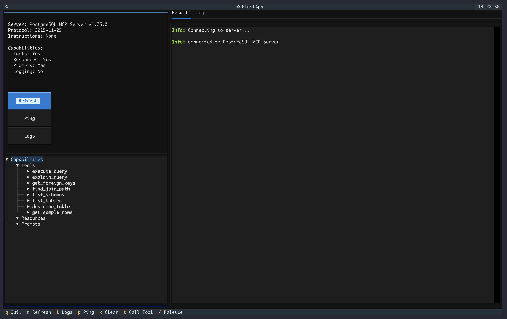

# Mamba MCP

A Python collection of MCP (Model Context Protocol) tools — a testing client and production MCP servers, distributed as a single package with optional extras.

## Installation

```bash
# Core only
pip install mamba-mcp

# With specific servers
pip install mamba-mcp[pg]       # PostgreSQL server
pip install mamba-mcp[fs]       # Filesystem server (local + S3)
pip install mamba-mcp[hana]     # SAP HANA server
pip install mamba-mcp[gitlab]   # GitLab server

# Client (TUI, CLI, Python API)
pip install mamba-mcp[client]

# Everything
pip install mamba-mcp[all]
```

## Modules

| Module | Extra | Description |
|--------|-------|-------------|
| `mamba_mcp_core` | *(base)* | Shared utilities (error models, fuzzy matching, CLI helpers, transport normalization) |
| `mamba_mcp_client` | `client` | MCP testing client with interactive TUI, CLI, and Python API |
| `mamba_mcp_pg` | `pg` | PostgreSQL MCP server — 8 tools across 3 layers |
| `mamba_mcp_fs` | `fs` | Filesystem MCP server with local and S3 backends — 12 tools across 3 layers |
| `mamba_mcp_hana` | `hana` | SAP HANA MCP server — 11 tools across 4 layers |
| `mamba_mcp_gitlab` | `gitlab` | GitLab MCP server — 18 tools across 4 categories |

### mamba-mcp-client

Testing and debugging tool for MCP servers. Supports stdio, SSE, HTTP, and UV-based transports.

#### Mamba MCP Client TUI




- **Interactive TUI** — Textual-based terminal interface for exploring servers in real-time
- **CLI Commands** — Quick one-off commands for inspection and scripting
- **Python API** — Fully async programmatic interface for test automation
- **Protocol Logging** — Detailed request/response capture with timing

```bash
# Launch interactive TUI
mamba-mcp tui --stdio "python server.py"

# CLI inspection
mamba-mcp tools --stdio "python server.py"
mamba-mcp call add --args '{"a": 5, "b": 3}' --stdio "python server.py"
```

### mamba-mcp-pg

PostgreSQL MCP server with a 3-layer tool architecture for AI assistants.

- **Layer 1: Schema Discovery** — List schemas, tables, describe columns, sample rows
- **Layer 2: Relationship Discovery** — Foreign keys, join path finding (BFS)
- **Layer 3: Query Execution** — Read-only SQL with parameterized queries and EXPLAIN support

```bash
# Test database connection
mamba-mcp-pg --env-file mamba.env test

# Run the MCP server
mamba-mcp-pg --env-file mamba.env
```

### mamba-mcp-fs

Filesystem MCP server with local and S3 backends for AI assistants.

- **Layer 1: Discovery** — List directories, read files, get metadata, search by name/content
- **Layer 2: S3 Extras** — List buckets, presigned URLs, object metadata (when S3 enabled)
- **Layer 3: Mutation** — Write, delete, move, copy files, create directories (when read-write)

```bash
# Test configuration and backend connectivity
mamba-mcp-fs --env-file mamba.env test

# Run the MCP server
mamba-mcp-fs --env-file mamba.env
```

### mamba-mcp-hana

SAP HANA MCP server with a 4-layer tool architecture for AI assistants.

- **Layer 1: Schema Discovery** — List schemas, tables, describe columns, sample rows
- **Layer 2: Relationship Discovery** — Foreign keys, join path finding (BFS)
- **Layer 3: Query Execution** — Read-only SQL with parameterized queries and EXPLAIN support
- **HANA-Specific Tools** — Calculation views, column/row store type, stored procedures

```bash
# Test database connection
mamba-mcp-hana --env-file mamba.env test

# Run the MCP server
mamba-mcp-hana --env-file mamba.env
```

### mamba-mcp-gitlab

GitLab MCP server for merge requests, issues, pipelines, and search.

- **Merge Requests (7)** — List, get, diffs, commits, pipelines, create, update
- **Issues (6)** — List, get, comments, create, update, add comment
- **Pipelines (4)** — List, get, jobs, job log
- **Search (1)** — Instance, project, or group scoped search

```bash
# Test GitLab connectivity
mamba-mcp-gitlab --env-file mamba.env test

# Run the MCP server
mamba-mcp-gitlab --env-file mamba.env
```

## Architecture

All four MCP server modules follow a consistent internal architecture built on **FastMCP** with a **layered tool system**:

```
__main__.py (Typer CLI)
  → server.py (FastMCP + lifespan resource management)
    → tools/ (MCP tool handlers, organized by layer)
      → database/ or backends/ (service layer)
        → models/ (Pydantic I/O contracts)
```

**Shared patterns across servers:**

- **Layered Tools** — Tools progress from discovery → relationships → execution, designed for incremental exploration by AI agents
- **AppContext via Lifespan** — Resources (DB engines, connection pools, backends) initialized at startup, cleaned up on shutdown
- **Pydantic Settings** — Environment-based configuration with `MAMBA_MCP_{PKG}_*` prefix and `mamba.env` file auto-discovery
- **Error Framework** — Structured error codes with fuzzy name matching ("did you mean?") suggestions
- **Service Layer** — Thin tool handlers delegate to service classes that encapsulate domain logic

**Tech stack:** Python 3.11+, FastMCP, Pydantic, Typer, Textual, SQLAlchemy+asyncpg, hdbcli, fsspec+s3fs, httpx

## Configuration

All servers use `mamba.env` for environment-based configuration. Default file locations (checked in order):

1. `./mamba.env` (project-local)
2. `~/mamba.env` (global fallback)

## Development

```bash
# Install with all extras and dev tools
uv sync --all-extras --group dev

# Run tests
uv run pytest tests/                    # all tests
uv run pytest tests/pg/                 # per-module
uv run pytest tests/core/ tests/client/ # multiple modules

# Type check
uv run mypy src/

# Lint and format
uv run ruff check src/
uv run ruff format src/
```

## Repository Structure

```
mamba-mcp/
├── pyproject.toml              # Single package config with extras
├── uv.lock                     # Shared lockfile
├── src/
│   ├── mamba_mcp_core/         # Shared utilities
│   ├── mamba_mcp_client/       # MCP testing client
│   ├── mamba_mcp_pg/           # PostgreSQL MCP server
│   ├── mamba_mcp_fs/           # Filesystem MCP server
│   ├── mamba_mcp_hana/         # SAP HANA MCP server
│   └── mamba_mcp_gitlab/       # GitLab MCP server
├── tests/
│   ├── core/
│   ├── client/
│   ├── pg/
│   ├── fs/
│   ├── hana/
│   └── gitlab/
├── examples/                   # Client usage examples
├── docs/                       # MkDocs documentation
└── internal/                   # Specs & images
```

## License

MIT
