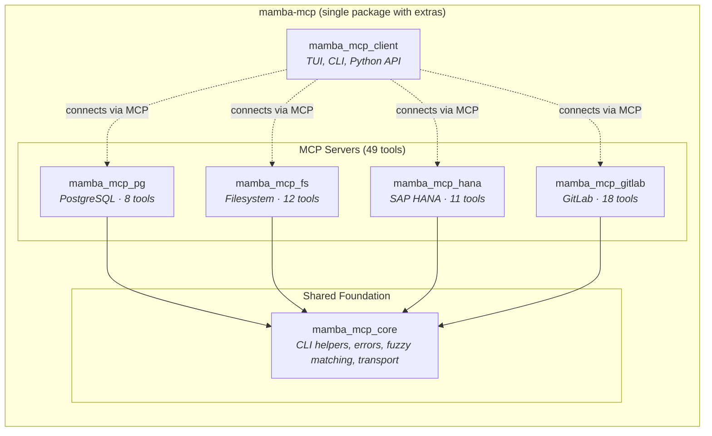
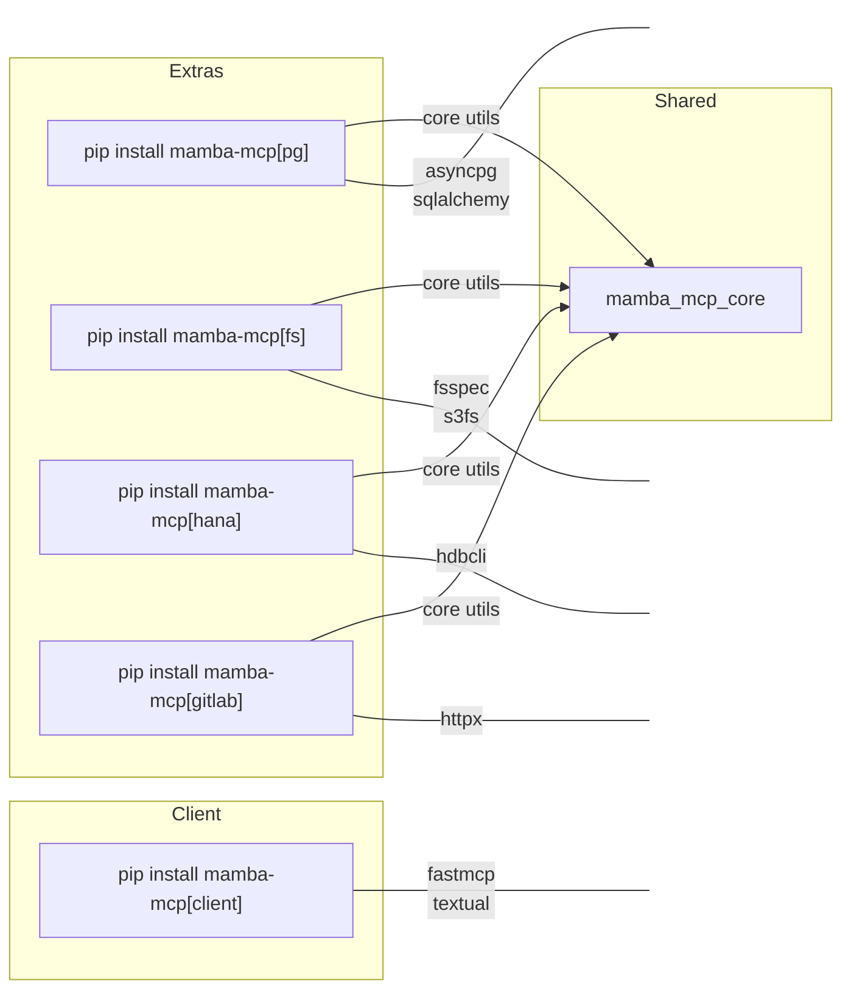
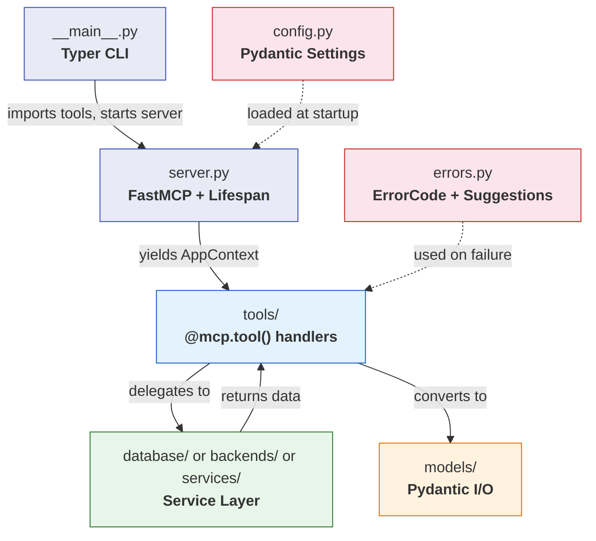
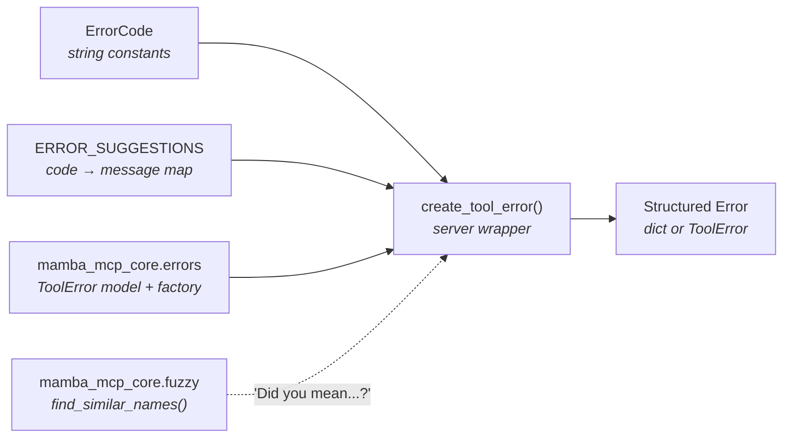
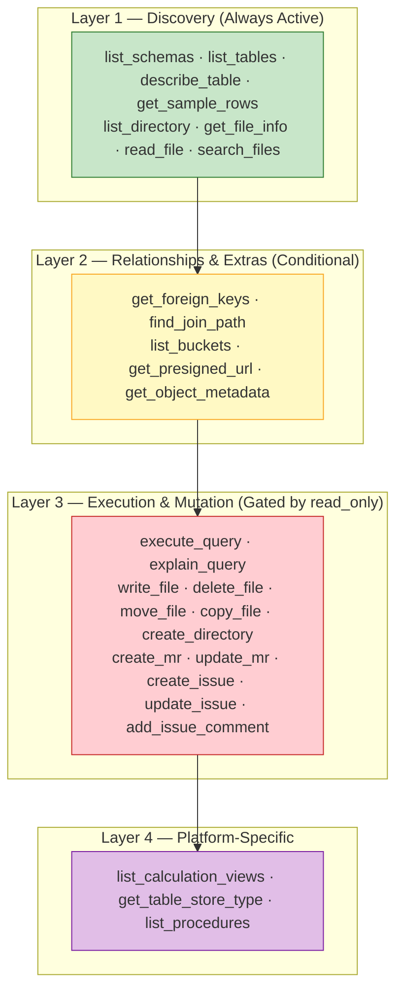

# Architecture

Mamba MCP is a single Python package with optional extras, containing six source modules that implement the [Model Context Protocol](https://modelcontextprotocol.io/) (MCP). The system is split into a shared core library, four independent MCP servers, and a standalone testing client. Together they expose **49 MCP tools** for database access, filesystem operations, GitLab integration, and server debugging.

This page covers the high-level system design, dependency graph, shared server architecture patterns, the layered tool model, and the key design decisions behind the codebase.

## System Overview

The package is organized around two axes: a **shared foundation** (core module consumed by all servers) and a **tool surface** (the MCP servers that expose tools to LLMs). The testing client sits outside this hierarchy entirely -- it connects to any MCP server over standard transports and has no compile-time dependency on any other module.



!!! info "Client Independence"
    `mamba_mcp_client` has **zero** import-time dependencies on `mamba_mcp_core` or any server module. It communicates exclusively through the MCP protocol over stdio, SSE, or HTTP transports. This means it can test any compliant MCP server, not just the ones in this package.

## Project Structure

```
mamba-mcp/
├── pyproject.toml              # Single package config, extras, ruff/mypy config
├── uv.lock                     # Lockfile
├── mkdocs.yml                  # Documentation site configuration
├── src/
│   ├── mamba_mcp_core/         # Shared library (no CLI, no env vars)
│   │   ├── cli.py              # validate_env_file, resolve_default_env_file, setup_logging
│   │   ├── config.py           # Module-level _env_file_path state management
│   │   ├── errors.py           # ToolError model & create_tool_error factory
│   │   ├── fuzzy.py            # Levenshtein distance & find_similar_names
│   │   └── transport.py        # normalize_transport ("http" → "streamable-http")
│   │
│   ├── mamba_mcp_client/       # Standalone testing tool
│   │   ├── cli.py              # Typer CLI entry point (9 commands)
│   │   ├── client.py           # MCPTestClient async context manager
│   │   ├── config.py           # Transport configs (Pydantic)
│   │   ├── logging.py          # Protocol logging
│   │   └── tui/app.py          # Textual TUI
│   │
│   ├── mamba_mcp_pg/           # PostgreSQL server
│   │   ├── __main__.py         # Typer CLI (serve / test)
│   │   ├── server.py           # FastMCP + AppContext + lifespan
│   │   ├── config.py           # Pydantic settings (MAMBA_MCP_PG_*)
│   │   ├── errors.py           # ErrorCode + suggestions + wrapper
│   │   ├── database/           # SQLAlchemy async services
│   │   ├── models/             # Pydantic I/O models
│   │   └── tools/              # 8 MCP tool handlers
│   │
│   ├── mamba_mcp_fs/           # Filesystem server
│   │   ├── __main__.py         # Typer CLI (serve / test)
│   │   ├── server.py           # FastMCP + AppContext + lifespan
│   │   ├── config.py           # Pydantic settings (MAMBA_MCP_FS_*)
│   │   ├── errors.py           # FSError hierarchy + error codes
│   │   ├── security.py         # Sandbox, path traversal, symlink policies
│   │   ├── rate_limit.py       # Sliding window rate limiter
│   │   ├── backends/           # BackendProtocol, LocalBackend, S3Backend
│   │   ├── models/             # Pydantic I/O models
│   │   └── tools/              # 12 MCP tool handlers
│   │
│   ├── mamba_mcp_hana/         # SAP HANA server
│   │   ├── __main__.py         # Typer CLI (serve / test)
│   │   ├── server.py           # FastMCP + AppContext + lifespan
│   │   ├── config.py           # Pydantic settings (MAMBA_MCP_HANA_*)
│   │   ├── errors.py           # ErrorCode + suggestions + wrapper
│   │   ├── database/           # HanaConnectionPool, async services
│   │   ├── models/             # Pydantic I/O models
│   │   └── tools/              # 11 MCP tool handlers
│   │
│   └── mamba_mcp_gitlab/       # GitLab server
│       ├── __main__.py         # Typer CLI (serve / test)
│       ├── server.py           # FastMCP + AppContext + lifespan
│       ├── config.py           # Pydantic settings (MAMBA_MCP_GITLAB_*)
│       ├── auth.py             # PAT + OAuth 2.0 strategies
│       ├── errors.py           # ErrorCode + suggestions + wrapper
│       ├── rate_limit.py       # Sliding window rate limiter
│       ├── services/           # GitLab API service classes
│       ├── models/             # Pydantic I/O models
│       └── tools/              # 18 MCP tool handlers
│
├── tests/
│   ├── core/                   # Core library tests
│   ├── client/                 # Client tests
│   ├── pg/                     # PostgreSQL server tests
│   ├── fs/                     # Filesystem server tests
│   ├── hana/                   # SAP HANA server tests
│   └── gitlab/                 # GitLab server tests
│
└── internal/                   # Specifications & design documents
```

## Dependency Graph

All four servers import from `mamba_mcp_core` for shared utilities. No server imports from any other server. The client depends on neither core nor any server.

Dependencies are managed through optional extras in a single `pyproject.toml`:



| Extra | Imports From | Key External Libraries |
|-------|-------------|----------------------|
| *(core -- always installed)* | *(none)* | `pydantic`, `typer` |
| `pg` | `mamba_mcp_core` | `sqlalchemy[asyncio]`, `asyncpg`, `mcp` |
| `fs` | `mamba_mcp_core` | `fsspec`, `s3fs`, `mcp` |
| `hana` | `mamba_mcp_core` | `hdbcli`, `mcp` |
| `gitlab` | `mamba_mcp_core` | `httpx`, `mcp` |
| `client` | *(independent)* | `fastmcp`, `textual`, `httpx` |

!!! warning "No Cross-Server Dependencies"
    The four servers are completely independent of each other. Importing `mamba_mcp_pg` never triggers loading of `mamba_mcp_hana`, `mamba_mcp_fs`, or `mamba_mcp_gitlab`. This isolation means each extra can be installed and deployed independently.

## Shared Server Architecture

All four MCP servers follow an identical internal architecture pattern, originally established in `mamba_mcp_pg` and replicated across FS, HANA, and GitLab. The diagram below shows how a request flows through any server.



### The Seven Shared Patterns

Each server implements the same seven structural patterns. Understanding these patterns once means understanding all four servers.

#### 1. AppContext via Lifespan

Every server defines a `@dataclass AppContext` that holds initialized resources (database engine, connection pool, HTTP client, backend manager). An `app_lifespan()` async context manager creates these resources at startup and tears them down on shutdown.

=== "PostgreSQL"

    ```python title="src/mamba_mcp_pg/server.py"
    @dataclass
    class AppContext:
        engine: AsyncEngine
        settings: Settings

    @asynccontextmanager
    async def app_lifespan(server: FastMCP) -> AsyncIterator[AppContext]:
        settings = get_settings()
        engine = await create_engine(settings.database)
        try:
            await test_connection(engine)
            yield AppContext(engine=engine, settings=settings)
        finally:
            await dispose_engine(engine)

    mcp = FastMCP("PostgreSQL MCP Server", lifespan=app_lifespan)
    ```

=== "SAP HANA"

    ```python title="src/mamba_mcp_hana/server.py"
    @dataclass
    class AppContext:
        pool: HanaConnectionPool
        settings: Settings

    @asynccontextmanager
    async def app_lifespan(server: FastMCP) -> AsyncIterator[AppContext]:
        settings = get_settings()
        pool = await create_pool(settings.database)
        try:
            await pool.test_connection()
            yield AppContext(pool=pool, settings=settings)
        finally:
            await pool.close()

    mcp = FastMCP("mamba-mcp-hana", lifespan=app_lifespan)
    ```

=== "Filesystem"

    ```python title="src/mamba_mcp_fs/server.py"
    @dataclass
    class AppContext:
        settings: Settings
        security: SecurityValidator
        backend_manager: BackendManager
        rate_limiter: RateLimiter

    @asynccontextmanager
    async def app_lifespan(server: FastMCP) -> AsyncIterator[AppContext]:
        settings = get_settings()
        security = SecurityValidator(server_settings=settings.server, ...)
        backend_manager = BackendManager(settings=settings, security=security)
        rate_limiter = RateLimiter(ops_per_minute=settings.server.rate_limit)
        yield AppContext(settings=settings, security=security,
                         backend_manager=backend_manager, rate_limiter=rate_limiter)

    mcp = FastMCP("mamba-mcp-fs", lifespan=app_lifespan)
    ```

=== "GitLab"

    ```python title="src/mamba_mcp_gitlab/server.py"
    @dataclass
    class AppContext:
        client: httpx.AsyncClient
        settings: Settings
        rate_limiter: RateLimiter
        auth_info: AuthInfo

    @asynccontextmanager
    async def app_lifespan(server: FastMCP) -> AsyncIterator[AppContext]:
        settings = get_settings()
        auth_strategy = detect_auth_strategy(settings)
        client = httpx.AsyncClient(base_url=settings.gitlab.url, ...)
        auth_info = await auth_strategy.validate(client)
        rate_limiter = RateLimiter(max_requests=settings.rate_limit.max_requests, ...)
        try:
            yield AppContext(client=client, settings=settings,
                             rate_limiter=rate_limiter, auth_info=auth_info)
        finally:
            await client.aclose()

    mcp = FastMCP("GitLab MCP Server", lifespan=app_lifespan)
    ```

#### 2. Tool Handler Skeleton

Every `@mcp.tool()` function follows the same 7-step skeleton. This consistency makes it possible to read any tool in the codebase and immediately understand its structure.

```python title="Canonical tool handler pattern"
@mcp.tool(annotations=ToolAnnotations(readOnlyHint=True, ...))
async def tool_name(
    param: str,
    ctx: Context[ServerSession, AppContext] | None = None,
) -> OutputModel | dict[str, Any]:
    """Tool description for LLM consumption."""
    # 1. Start timing
    start_time = time.perf_counter()

    # 2. Null-check context
    if ctx is None:
        return create_tool_error(ErrorCode.CONNECTION_ERROR, "No context available", "tool_name")

    # 3. Extract AppContext
    app_ctx = ctx.request_context.lifespan_context

    try:
        # 4. Acquire connection / resource
        async with app_ctx.engine.connect() as conn:
            # 5. Delegate to service layer
            service = SomeService(conn)
            result = await service.do_work(param)

        # 6. Convert to Pydantic output model
        elapsed_ms = (time.perf_counter() - start_time) * 1000
        return OutputModel(**result)

    except Exception as e:
        # 7. Return structured error with timing
        elapsed_ms = (time.perf_counter() - start_time) * 1000
        return create_tool_error(ErrorCode.SOME_ERROR, str(e), "tool_name", {"param": param})
```

#### 3. Error Handling Triad

Each server's `errors.py` contains three components that work together. The core library provides the shared `ToolError` model and `create_tool_error()` factory, while each server injects its own domain-specific error codes and suggestions.



```python title="src/mamba_mcp_pg/errors.py"
class ErrorCode:
    SCHEMA_NOT_FOUND = "SCHEMA_NOT_FOUND"
    TABLE_NOT_FOUND = "TABLE_NOT_FOUND"
    INVALID_SQL = "INVALID_SQL"
    # ... more codes

ERROR_SUGGESTIONS: dict[str, str] = {
    ErrorCode.SCHEMA_NOT_FOUND: "List available schemas with list_schemas",
    ErrorCode.TABLE_NOT_FOUND: "List tables in schema with list_tables",
    # ... more suggestions
}

def create_tool_error(code, message, tool_name, ...):
    """Wraps core factory, injects server-specific suggestions map."""
    error = _core_create_tool_error(..., suggestions_map=ERROR_SUGGESTIONS)
    return error.model_dump()  # PG returns dict for backward compat
```

!!! note "Return Type Variance"
    PG's wrapper returns `dict[str, Any]` (for backward compatibility), HANA returns the `ToolError` model directly, and FS uses its own exception hierarchy (`FSError` base with 9 subclasses) for internal flow control. All share the core `ToolError` model -- the wrapper is the only difference.

#### 4. Module-Level Config State

A global `_env_file_path` variable bridges the gap between CLI argument parsing (Typer, at import time) and configuration loading (Pydantic Settings, at runtime). The core library owns this state; servers import `set_env_file_path` and `get_env_file_path`.

```python title="src/mamba_mcp_core/config.py"
_env_file_path: str | None = None

def set_env_file_path(path: str | None) -> None:
    global _env_file_path
    _env_file_path = path

def get_env_file_path() -> str | None:
    return _env_file_path
```

#### 5. Nested Pydantic Settings

Every server uses a root `Settings` class that composes nested settings classes (`DatabaseSettings`, `ServerSettings`, etc.). A `@model_validator(mode="before")` hook instantiates each nested class with the correct `_env_file` parameter, connecting the module-level config state from pattern 4.

```python title="src/mamba_mcp_pg/config.py"
class Settings(BaseSettings):
    database: DatabaseSettings = Field(default=None)
    server: ServerSettings = Field(default=None)

    @model_validator(mode="before")
    @classmethod
    def load_nested_settings(cls, data: dict[str, Any]) -> dict[str, Any]:
        env_file = get_env_file_path()
        if "database" not in data or data["database"] is None:
            data["database"] = DatabaseSettings(_env_file=env_file)
        if "server" not in data or data["server"] is None:
            data["server"] = ServerSettings(_env_file=env_file)
        return data
```

#### 6. CLI Entry Point

Every server uses a Typer app with `invoke_without_command=True`. Running the CLI bare starts the MCP server; the `test` subcommand validates connectivity and exits.

```python title="src/mamba_mcp_pg/__main__.py"
app = typer.Typer(name="mamba-mcp-pg", no_args_is_help=False)

@app.callback(invoke_without_command=True)
def main(ctx: typer.Context, env_file: str | None = None) -> None:
    resolved = resolve_default_env_file(env_file)
    set_env_file_path(resolved)
    if ctx.invoked_subcommand is not None:
        return
    # Start the server
    settings = get_settings()
    transport = normalize_transport(settings.server.transport)
    mcp.run(transport=transport)

@app.command()
def test() -> None:
    """Test database connection and exit."""
    # ... validate connectivity
```

#### 7. Tool Registration via Import Side-Effects

Tool modules import the module-level `mcp` instance from `server.py` and register tools via `@mcp.tool()` decorators at import time. The `__main__.py` triggers this with explicit imports that are otherwise unused.

```python title="src/mamba_mcp_pg/__main__.py"
from mamba_mcp_pg.tools import query_tools, relationship_tools, schema_tools  # noqa: F401
```

## Layered Tool Architecture

Tools across all servers are organized into layers that control registration and access. Lower layers are always available; higher layers are conditionally registered based on configuration.



| Layer | Name | Registration | Description |
|-------|------|-------------|-------------|
| **1** | Discovery | Always registered | Read-only tools for exploring schemas, directories, files. Every server has these. |
| **2** | Relationships / Extras | Conditional | Foreign key navigation (PG, HANA), S3-specific tools (FS). Registered when the feature is available. |
| **3** | Execution / Mutation | Gated by `read_only` | SQL query execution (PG, HANA), file write operations (FS), create/update operations (GitLab). Disabled when the server runs in read-only mode. |
| **4** | Platform-Specific | Always registered (HANA only) | HANA-specific tools like calculation views, store types, and procedures that have no equivalent in other servers. |

### Tool Distribution by Server

| Server | Layer 1 | Layer 2 | Layer 3 | Layer 4 | Total |
|--------|---------|---------|---------|---------|-------|
| **PostgreSQL** | `list_schemas`, `list_tables`, `describe_table`, `get_sample_rows` | `get_foreign_keys`, `find_join_path` | `execute_query`, `explain_query` | -- | **8** |
| **Filesystem** | `list_directory`, `get_file_info`, `read_file`, `search_files` | `list_buckets`, `get_presigned_url`, `get_object_metadata` | `write_file`, `delete_file`, `move_file`, `copy_file`, `create_directory` | -- | **12** |
| **SAP HANA** | `list_schemas`, `list_tables`, `describe_table`, `get_sample_rows` | `get_foreign_keys`, `find_join_path` | `execute_query`, `explain_query` | `list_calculation_views`, `get_table_store_type`, `list_procedures` | **11** |
| **GitLab** | `list_mrs`, `get_mr`, `get_mr_diffs`, `get_mr_commits`, `get_mr_pipelines`, `list_issues`, `get_issue`, `list_issue_comments`, `list_pipelines`, `get_pipeline`, `get_pipeline_jobs`, `get_job_log`, `search` | -- | `create_mr`, `update_mr`, `create_issue`, `update_issue`, `add_issue_comment` | -- | **18** |

!!! tip "GitLab Layering"
    GitLab uses a different categorization (Merge Requests, Issues, Pipelines, Search) rather than the strict Discovery/Relationship/Execution layers. However, the same `read_only` gating applies: the 5 mutation tools (`create_mr`, `update_mr`, `create_issue`, `update_issue`, `add_issue_comment`) are disabled at runtime when `read_only=true`.

## How Core is Consumed

The `mamba_mcp_core` module provides five small modules that eliminate code duplication across all four servers. None of these modules contain domain-specific logic -- they are pure utility functions with dependency injection.

| Core Module | Purpose | Consumed By |
|------------|---------|-------------|
| `cli.py` | `validate_env_file()`, `resolve_default_env_file()`, `setup_logging()` | Every server's `__main__.py` |
| `config.py` | `set_env_file_path()`, `get_env_file_path()` module-level state | Every server's `config.py` and `__main__.py` |
| `errors.py` | `ToolError` Pydantic model, `create_tool_error()` factory | Every server's `errors.py` wrapper |
| `fuzzy.py` | `levenshtein_distance()`, `find_similar_names()` with scaled threshold | Every server's `errors.py` for "Did you mean...?" suggestions |
| `transport.py` | `normalize_transport()` maps `"http"` to `"streamable-http"` | Every server's `__main__.py` |

The core library uses **dependency injection** for server-specific behavior. For example, `create_tool_error()` accepts a `suggestions_map` parameter -- each server passes its own `ERROR_SUGGESTIONS` dict rather than the core hardcoding any domain knowledge.

```python title="Dependency injection in practice"
# Core provides the factory (generic)
from mamba_mcp_core.errors import create_tool_error as _core_create_tool_error

# Server provides the domain knowledge (specific)
error = _core_create_tool_error(
    code="TABLE_NOT_FOUND",
    message="Table 'users' not found",
    tool_name="describe_table",
    suggestions_map=ERROR_SUGGESTIONS,  # Server-specific dict
)
```

## Key Design Decisions

### Database Server Async Strategies

| Context | Decision | Rationale |
|---------|----------|-----------|
| PostgreSQL needs async database access | Use SQLAlchemy async with asyncpg driver | SQLAlchemy provides mature async support via `sqlalchemy[asyncio]`. The asyncpg driver is the standard choice for async PostgreSQL in Python. |
| SAP HANA needs async database access | Wrap synchronous hdbcli with `asyncio.to_thread()` | The official SAP HANA Python driver (`hdbcli`) is synchronous-only. Using `sqlalchemy-hana` was considered but rejected because HANA is read-only in this context and the SQLAlchemy abstraction added complexity without benefit. A queue-based `HanaConnectionPool` wraps the sync calls in `asyncio.to_thread()` for non-blocking operation. |

### Filesystem Backend Abstraction

| Context | Decision | Rationale |
|---------|----------|-----------|
| FS server needs to support local and S3 storage | Use `BackendProtocol` + `BackendManager` routing via fsspec | A `BackendProtocol` (runtime-checkable `Protocol`) defines the unified interface. `BackendManager` auto-detects the target backend from path prefix (`s3://` vs local) and routes operations accordingly. The `fsspec` library provides the underlying filesystem implementations for both local and S3 backends. |
| FS server needs defense-in-depth security | Dedicated `SecurityValidator` with sandbox enforcement | Path traversal, symlink following, hidden file access, and extension filtering are all enforced by a centralized `SecurityValidator` that runs before every backend operation. This is the most security-critical code in the codebase. |

### GitLab API Integration

| Context | Decision | Rationale |
|---------|----------|-----------|
| GitLab server needs HTTP API access | Use httpx with service layer pattern | httpx provides async HTTP with connection pooling. A service layer (`MergeRequestService`, `IssueService`, etc.) encapsulates API endpoint logic, keeping tool handlers thin. |
| GitLab server needs multiple auth methods | Strategy pattern with PAT and OAuth 2.0 | An `AuthStrategy` protocol with two implementations (`PATAuthStrategy`, `OAuthAuthStrategy`) allows seamless switching. PAT takes precedence when both are configured. OAuth handles automatic token refresh with a 30-second expiry buffer. |

### Client Independence

| Context | Decision | Rationale |
|---------|----------|-----------|
| Testing client should work with any MCP server | No dependency on core or any server module | The client communicates exclusively through the MCP protocol over standard transports (stdio, SSE, HTTP). This means it can test third-party MCP servers, not just those in this package. |

### Single Package with Extras

| Context | Decision | Rationale |
|---------|----------|-----------|
| Multiple modules need coordinated development and release | Single package with optional extras instead of UV workspace monorepo | A single `pyproject.toml` with extras (`pip install mamba-mcp[pg]`) simplifies the release process, eliminates inter-package version coordination, and provides a cleaner install experience. Users install one package name with the extras they need rather than remembering separate package names. |

## Technology Stack

| Role | Technology | Version |
|------|-----------|---------|
| Language | Python | 3.11+ |
| MCP Framework | FastMCP (`mcp`) | >= 1.0.0 |
| Validation | Pydantic + pydantic-settings | -- |
| CLI Framework | Typer | -- |
| TUI Framework | Textual | -- |
| Package Manager | UV | -- |
| Linting | Ruff | Line length: 100 |
| Type Checking | MyPy | Strict mode |
| Testing | pytest + pytest-asyncio | Auto async mode |

## What's Next

- **[Core Library](packages/core.md)** -- API reference for the shared utilities
- **[MCP Client](packages/client.md)** -- How to use the testing client
- **[PostgreSQL Server](servers/pg.md)** -- PG server configuration and tool reference
- **[Filesystem Server](servers/fs.md)** -- FS server with local and S3 backends
- **[SAP HANA Server](servers/hana.md)** -- HANA server configuration and tool reference
- **[GitLab Server](servers/gitlab.md)** -- GitLab server auth, tools, and configuration
- **[Development Guide](development.md)** -- Contributing, testing, and creating new server packages
