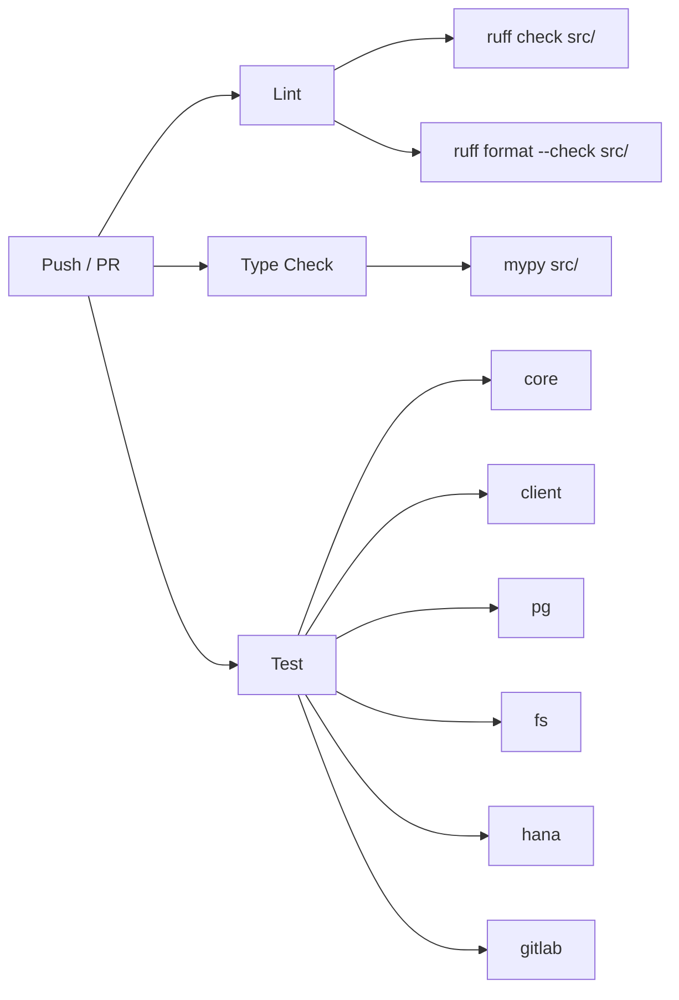

# Development Guide

This guide covers everything you need to set up a local development environment, run tests, and contribute to Mamba MCP.

## Prerequisites

Before getting started, make sure the following tools are installed on your machine.

| Tool | Version | Purpose |
|------|---------|---------|
| **Python** | 3.11+ | Runtime |
| **UV** | Latest | Package manager |
| **Git** | 2.x+ | Version control |

!!! tip "Installing UV"
    UV is the only package manager used in this project. Install it with:

    ```bash
    curl -LsSf https://astral.sh/uv/install.sh | sh
    ```

    See the [UV documentation](https://docs.astral.sh/uv/) for platform-specific instructions.

## Development Setup

### 1. Clone the Repository

```bash
git clone https://github.com/sequenzia/mamba-mcp.git
cd mamba-mcp
```

### 2. Install with All Extras

A single command installs the package with all optional extras and development dependencies:

```bash
uv sync --all-extras --group dev
```

This resolves the full dependency graph across all extras (`client`, `pg`, `fs`, `hana`, `gitlab`) and pins everything in the `uv.lock` lockfile.

### 3. Verify the Installation

```bash
uv run mamba-mcp --help
```

You should see the CLI help output for the MCP test client.

### Dev Dependencies

The `[dependency-groups]` in `pyproject.toml` provides these shared development tools:

| Package | Version | Purpose |
|---------|---------|---------|
| `pytest` | >=8.0.0 | Test runner |
| `pytest-asyncio` | >=0.23.0 | Async test support |
| `pytest-cov` | >=4.0.0 | Coverage reporting |
| `ruff` | >=0.3.0 | Linting and formatting |
| `mypy` | >=1.8.0 | Static type checking |
| `respx` | >=0.22.0 | HTTPX request mocking (used by GitLab tests) |

## Running Tests

### Test Suites

Each module has its own test suite under `tests/`. You can run all tests at once or target a specific suite:

```bash
# Run all tests
uv run pytest tests/

# Run a specific suite
uv run pytest tests/core/
uv run pytest tests/client/
uv run pytest tests/pg/
uv run pytest tests/fs/
uv run pytest tests/hana/
uv run pytest tests/gitlab/
```

### Running with Coverage

```bash
uv run pytest tests/pg/ --cov=mamba_mcp_pg --cov-report=term-missing
```

### Running a Specific Test

```bash
uv run pytest tests/pg/test_schema_tools.py::TestListSchemas -v
```

### Verbose Output

```bash
uv run pytest tests/pg/ --tb=short -q
```

## Type Checking

The project uses MyPy in **strict mode** across all source modules:

```bash
uv run mypy src/
```

!!! info "MyPy Configuration"
    Strict mode is configured in `pyproject.toml` with targeted overrides:

    - **Test and example directories** are excluded from type checking
    - **Third-party libraries** without stubs (e.g., `mcp`, `fastmcp`, `textual`, `hdbcli`) have `ignore_missing_imports = true`
    - **Tool modules** relax `disallow_untyped_decorators` because `@mcp.tool()` decorators lack type stubs
    - **Backend modules** relax `warn_return_any` for libraries like `fsspec` and `hdbcli` that return untyped values

## Linting and Formatting

The project uses [Ruff](https://docs.astral.sh/ruff/) for both linting and formatting.

### Check for Lint Errors

```bash
uv run ruff check src/
```

### Auto-Fix Lint Errors

```bash
uv run ruff check src/ --fix
```

### Format Code

```bash
uv run ruff format src/
```

### Check Formatting Without Modifying Files

```bash
uv run ruff format --check src/
```

### Ruff Configuration

The Ruff rules are defined in `pyproject.toml`:

```toml title="pyproject.toml"
[tool.ruff]
line-length = 100
target-version = "py311"

[tool.ruff.lint]
select = ["E", "F", "I", "N", "W", "UP"]
```

| Rule Set | What It Covers |
|----------|---------------|
| `E` | pycodestyle errors |
| `F` | Pyflakes (unused imports, undefined names) |
| `I` | isort (import ordering) |
| `N` | pep8-naming conventions |
| `W` | pycodestyle warnings |
| `UP` | pyupgrade (modern Python syntax) |

## Adding Dependencies

### To a Specific Extra

Add dependencies to the appropriate optional extra group in `pyproject.toml`. For example, to add a library needed by the PostgreSQL server, add it to the `pg` extra in the `[project.optional-dependencies]` section.

### To the Dev Dependency Group

```bash
uv add --group dev some-dev-tool
```

!!! note "Lockfile"
    All dependency changes update the `uv.lock` file. Commit this file alongside your `pyproject.toml` changes.

## CI/CD

The CI pipeline is defined in `.github/workflows/ci.yml` and runs on every push to `main` and on pull requests targeting `main`.

### Pipeline Structure

Three jobs run **in parallel**:



### Jobs

=== "Lint"

    Checks code style and formatting:

    ```yaml
    - run: uv run ruff check src/
    - run: uv run ruff format --check src/
    ```

=== "Type Check"

    Runs MyPy in strict mode:

    ```yaml
    - run: uv run mypy src/
    ```

=== "Test"

    Uses a matrix strategy to run each test suite with `fail-fast: false`:

    ```yaml
    strategy:
      fail-fast: false
      matrix:
        suite:
          - core
          - client
          - pg
          - fs
          - hana
          - gitlab
    steps:
      - run: uv run pytest tests/${{ matrix.suite }}/ --tb=short -q
    ```

All jobs use `astral-sh/setup-uv@v4` with caching enabled for fast installs.

## Testing Conventions

Follow these conventions when writing tests for any module.

### Class-Based Organization

Group related tests into classes. Each class focuses on a single function, feature, or component:

```python title="tests/pg/test_schema_tools.py"
class TestListSchemas:
    """Tests for list_schemas functionality."""

    async def test_list_schemas_excludes_system_by_default(
        self, mock_connection: MagicMock
    ) -> None:
        """Test that system schemas are excluded by default."""
        mock_result = create_mock_result([
            {"name": "public", "owner": "postgres", "description": None, "table_count": 10},
        ])
        mock_connection.execute.return_value = mock_result

        service = SchemaService(mock_connection, 30000)
        schemas = await service.list_schemas(include_system=False)

        assert len(schemas) == 1
        assert schemas[0]["name"] == "public"


class TestListTables:
    """Tests for list_tables functionality."""

    async def test_list_tables_returns_tables(self, mock_connection: MagicMock) -> None:
        """Test basic table listing."""
        # ...
```

### Naming and Docstrings

- **File naming**: `test_<module>.py` mirrors the source module structure
- **Method naming**: Descriptive names that explain the scenario, e.g., `test_list_schemas_excludes_system_by_default`
- **Docstrings**: Every test method has a one-line docstring explaining what it verifies

### Async Test Mode

The `pyproject.toml` sets `asyncio_mode = "auto"`, which means you do **not** need `@pytest.mark.asyncio` on async test methods. Just define them as `async def`:

```python
async def test_some_async_operation(self) -> None:
    """Test that the async operation completes successfully."""
    result = await some_function()
    assert result is not None
```

### Parametrize for Repetitive Cases

Use `@pytest.mark.parametrize` when you have three or more similar test cases:

```python
@pytest.mark.parametrize(
    "input_name, expected",
    [
        ("users", True),
        ("nonexistent", False),
        ("USERS", False),  # Case-sensitive
    ],
)
async def test_table_exists(self, input_name: str, expected: bool) -> None:
    """Test table existence check with various inputs."""
    # ...
```

### Autouse Fixtures for State Reset

Module-level state (like `_env_file_path`) must be reset between tests using autouse fixtures:

```python title="tests/pg/conftest.py"
@pytest.fixture(autouse=True)
def reset_env_file_path() -> Generator[None, None, None]:
    """Reset env file path state before and after each test."""
    set_env_file_path(None)
    yield
    set_env_file_path(None)
```

### Mock Helpers

Each server's test suite provides `create_mock_result()` in its `conftest.py` for constructing mock database rows:

```python title="tests/pg/conftest.py"
def create_mock_result(rows: list[dict[str, Any]]) -> MagicMock:
    """Create a mock database result."""
    mock_result = MagicMock()
    mock_rows = []
    for row_data in rows:
        mock_row = MagicMock()
        mock_row._mapping = row_data
        mock_rows.append(mock_row)
    mock_result.fetchall.return_value = mock_rows
    mock_result.fetchone.return_value = mock_rows[0] if mock_rows else None
    return mock_result
```

### Coverage Targets

- **Security-critical modules** (e.g., `mamba_mcp_fs/security.py`) target **100% coverage**
- All other modules should have meaningful coverage of happy paths, error paths, and edge cases

## Code Standards

| Standard | Value |
|----------|-------|
| Python version | 3.11+ |
| Line length | 100 characters |
| Type checking | MyPy strict mode |
| Linter/Formatter | Ruff |
| Ruff rules | E, F, I, N, W, UP |
| Async test mode | `asyncio_mode = "auto"` |
| Type union syntax | `str \| None` (not `Optional[str]`) |

### Pydantic Model Conventions

- Input/Output model pairs per tool: `ListSchemasInput` / `ListSchemasOutput`
- All fields use `Field(description="...")` for MCP tool parameter documentation
- Validation via `Field(ge=1, le=100)`, `pattern=`, `min_length` / `max_length`
- Centralized exports in `models/__init__.py` with `__all__`

## Creating a New Server Module

To add a new MCP server, create a new source module under `src/` and a corresponding test suite under `tests/`. Use `mamba_mcp_pg` as the canonical template.

### Required Structure

```
src/mamba_mcp_<name>/
├── __init__.py
├── __main__.py        # Typer CLI entry point
├── server.py          # FastMCP server + lifespan
├── config.py          # Pydantic settings
├── errors.py          # Error codes + suggestions
├── models/            # Input/Output Pydantic models
│   └── __init__.py
├── tools/             # @mcp.tool() handlers
│   └── __init__.py
└── database/          # Service layer (or backends/, services/)
    └── __init__.py

tests/<name>/
├── __init__.py
└── conftest.py
```

### Step-by-Step

#### 1. Register the Extra in `pyproject.toml`

Add a new optional extra for the server's dependencies:

```toml title="pyproject.toml"
[project.optional-dependencies]
# ... existing extras ...
<name> = [
    "mcp>=1.0.0",
    "pydantic>=2.0.0",
    "pydantic-settings>=2.0.0",
    "typer>=0.12.0",
    # Add your server-specific dependencies here
]

[project.scripts]
# ... existing scripts ...
mamba-mcp-<name> = "mamba_mcp_<name>.__main__:app"
```

Also add the new extra to the `all` group so `pip install mamba-mcp[all]` includes it.

#### 2. `server.py` -- AppContext and Lifespan

Every server uses a `@dataclass AppContext` yielded from an async lifespan context manager:

```python title="src/mamba_mcp_<name>/server.py"
from collections.abc import AsyncIterator
from contextlib import asynccontextmanager
from dataclasses import dataclass

from mcp.server.fastmcp import FastMCP

from mamba_mcp_<name>.config import Settings, get_settings


@dataclass
class AppContext:
    """Application context with shared resources."""
    settings: Settings
    # Add your resources: engine, pool, client, etc.


@asynccontextmanager
async def app_lifespan(server: FastMCP) -> AsyncIterator[AppContext]:
    """Manage application lifecycle."""
    settings = get_settings()

    # Initialize resources
    # resource = await create_resource(settings)

    try:
        yield AppContext(settings=settings)
    finally:
        # Cleanup resources
        pass


mcp = FastMCP("Your MCP Server", lifespan=app_lifespan)
```

#### 3. `__main__.py` -- CLI Entry Point

Follow the Typer pattern with `invoke_without_command=True`:

```python title="src/mamba_mcp_<name>/__main__.py"
import typer
from mamba_mcp_core.cli import resolve_default_env_file, setup_logging, validate_env_file
from mamba_mcp_core.transport import normalize_transport

from mamba_mcp_<name>.config import get_settings, set_env_file_path
from mamba_mcp_<name>.server import mcp

# Import tools to register them via side-effects
from mamba_mcp_<name>.tools import my_tools  # noqa: F401

app = typer.Typer(name="mamba-mcp-<name>", no_args_is_help=False)


@app.callback(invoke_without_command=True)
def main(ctx: typer.Context, env_file: str | None = None) -> None:
    """Your MCP Server description."""
    resolved_env_file = resolve_default_env_file(env_file)

    if ctx.invoked_subcommand is not None:
        set_env_file_path(resolved_env_file)
        return

    set_env_file_path(resolved_env_file)
    settings = get_settings()
    setup_logging(settings.server.log_level, settings.server.log_format)

    transport = normalize_transport(settings.server.transport)
    if transport == "stdio":
        mcp.run(transport="stdio")
    else:
        mcp.run(transport="streamable-http")


@app.command()
def test() -> None:
    """Test connectivity and exit."""
    # Validate your connection here
    typer.echo("Connection successful")
    raise typer.Exit(0)
```

#### 4. `config.py` -- Nested Pydantic Settings

Use the model validator pattern for env file bridging:

```python title="src/mamba_mcp_<name>/config.py"
from mamba_mcp_core.config import get_env_file_path, set_env_file_path
from pydantic import Field, model_validator
from pydantic_settings import BaseSettings, SettingsConfigDict

__all__ = ["get_env_file_path", "set_env_file_path", "get_settings", "Settings"]


class ServerSettings(BaseSettings):
    model_config = SettingsConfigDict(
        env_prefix="MAMBA_MCP_<NAME>_",
        env_file="mamba.env",
        extra="ignore",
    )

    transport: str = Field(default="stdio")
    log_level: str = Field(default="INFO")
    log_format: str = Field(default="json", pattern="^(json|text)$")


class Settings(BaseSettings):
    model_config = SettingsConfigDict(env_nested_delimiter="__")

    server: ServerSettings = Field(default=None)  # type: ignore[assignment]

    @model_validator(mode="before")
    @classmethod
    def load_nested_settings(cls, data: dict) -> dict:
        env_file = get_env_file_path()
        if "server" not in data or data["server"] is None:
            data["server"] = ServerSettings(_env_file=env_file)  # type: ignore[call-arg]
        return data


def get_settings() -> Settings:
    return Settings()
```

#### 5. `errors.py` -- Error Codes and Suggestions

```python title="src/mamba_mcp_<name>/errors.py"
from mamba_mcp_core.errors import create_tool_error as _core_create_tool_error
from mamba_mcp_core.fuzzy import find_similar_names


class ErrorCode:
    NOT_FOUND = "NOT_FOUND"
    CONNECTION_ERROR = "CONNECTION_ERROR"
    # Add your error codes


ERROR_SUGGESTIONS: dict[str, str] = {
    ErrorCode.NOT_FOUND: "Check that the resource exists",
    ErrorCode.CONNECTION_ERROR: "Check connectivity settings",
}


def create_tool_error(code, message, tool_name, input_received=None, context=None, suggestion=None):
    error = _core_create_tool_error(
        code=code, message=message, tool_name=tool_name,
        input_received=input_received, context=context,
        suggestion=suggestion, suggestions_map=ERROR_SUGGESTIONS,
    )
    return error.model_dump()
```

#### 6. Tool Handlers

Every `@mcp.tool()` function follows a consistent skeleton:

```python title="src/mamba_mcp_<name>/tools/my_tools.py"
import logging
import time
from typing import Any

from mcp.server.fastmcp import Context
from mcp.server.session import ServerSession

from mamba_mcp_<name>.errors import ErrorCode, create_tool_error
from mamba_mcp_<name>.server import AppContext, mcp

logger = logging.getLogger(__name__)


@mcp.tool()
async def my_tool(
    param: str,
    ctx: Context[ServerSession, AppContext] | None = None,
) -> MyOutput | dict[str, Any]:
    """Tool description for MCP discovery."""
    start_time = time.perf_counter()

    # 1. Null-check context
    if ctx is None:
        return create_tool_error(ErrorCode.CONNECTION_ERROR, "No context", "my_tool")

    # 2. Extract app context
    app_ctx = ctx.request_context.lifespan_context

    try:
        # 3. Acquire connection / resource
        # 4. Delegate to service layer
        # 5. Convert to Pydantic output model
        result = ...

        elapsed_ms = (time.perf_counter() - start_time) * 1000
        logger.debug("my_tool completed in %.2fms", elapsed_ms)
        return result
    except Exception as e:
        # 6. Return structured error with timing
        elapsed_ms = (time.perf_counter() - start_time) * 1000
        logger.error("my_tool failed after %.2fms: %s", elapsed_ms, str(e))
        return create_tool_error(ErrorCode.CONNECTION_ERROR, str(e), "my_tool", {"param": param})
```

#### 7. Register in CI

Add the new test suite to the CI test matrix in `.github/workflows/ci.yml` and run `uv sync --all-extras --group dev` to resolve the new dependencies.

## Git Conventions

### Conventional Commits

All commit messages follow the [Conventional Commits](https://www.conventionalcommits.org/) format:

```
type(scope): description
```

| Type | When to Use |
|------|-------------|
| `feat` | New feature |
| `fix` | Bug fix |
| `docs` | Documentation changes |
| `style` | Formatting, whitespace (no code change) |
| `refactor` | Code restructuring (no behavior change) |
| `test` | Adding or updating tests |
| `chore` | Build config, CI, dependencies |

### Scope

The scope identifies the affected module or area:

| Scope | Module |
|-------|--------|
| `core` | mamba_mcp_core |
| `client` | mamba_mcp_client |
| `pg` | mamba_mcp_pg |
| `fs` | mamba_mcp_fs |
| `hana` | mamba_mcp_hana |
| `gitlab` | mamba_mcp_gitlab |
| `ci` | CI/CD pipeline |
| `spec` | Internal specifications |

### Examples

```
feat(pg): add table comment extraction to describe_table
fix(fs): prevent path traversal through symlink resolution
docs(spec): add comprehensive gitlab mcp server specification
test(client): add comprehensive test coverage and enhance error handling
chore(ci): enable UV caching in GitHub Actions
refactor(core): consolidate fuzzy matching into shared module
```

!!! tip "Commit Message Quality"
    Write commit messages that explain **why** the change was made, not just what changed. The diff already shows the "what" -- the message should capture intent and context.

### Atomic Commits

Keep commits focused on a single logical change. If a feature requires test updates, configuration changes, and new code, those can be in one commit if they are tightly coupled. Split unrelated changes into separate commits.
