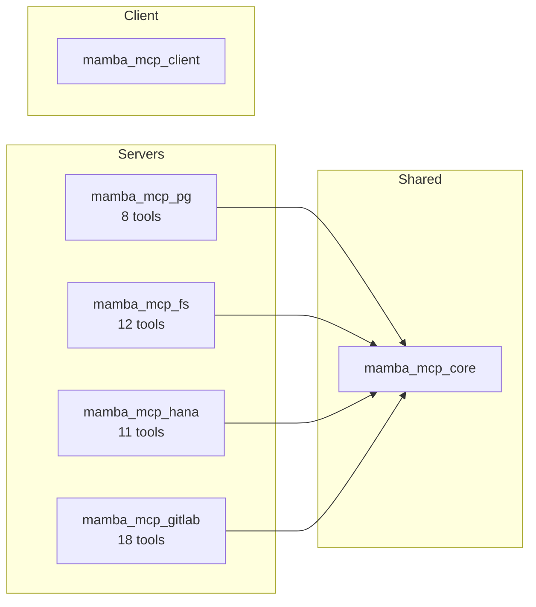

# Mamba MCP

A Python package of MCP (Model Context Protocol) tools -- a testing client and production MCP servers.

---

## What is Mamba MCP?

Mamba MCP is a single Python package with optional extras. It provides:

- **4 MCP servers** that expose databases, filesystems, and APIs as tools for AI assistants
- **1 testing client** with a TUI, CLI, and Python API for debugging any MCP server
- **1 shared library** of utilities consumed by all servers

Together, the servers expose **49 MCP tools** that enable AI assistants to explore database schemas, read files, query data, manage GitLab resources, and more -- all through the standardized Model Context Protocol.

## Extras

### Core & Client

| Extra | Description |
|-------|-------------|
| *(core -- always installed)* | Shared utilities: CLI helpers, error models, fuzzy matching, transport normalization |
| **[client](packages/client.md)** | Testing and debugging tool for any MCP server (TUI, CLI, Python API) |

### MCP Servers

| Extra | Tools | Description |
|-------|-------|-------------|
| **[pg](servers/pg.md)** | 8 | PostgreSQL server with layered schema discovery and read-only query execution |
| **[fs](servers/fs.md)** | 12 | Filesystem server with local and S3 backend support |
| **[hana](servers/hana.md)** | 11 | SAP HANA server with layered schema discovery and HANA-specific tools |
| **[gitlab](servers/gitlab.md)** | 18 | GitLab server for merge requests, issues, pipelines, and search |

## Architecture at a Glance

- **Servers depend on core** for shared CLI helpers, error models, and fuzzy matching
- **Client is independent** -- it communicates via MCP protocol and can test any MCP server
- **No cross-server dependencies** -- each server extra is independently installable

Learn more in the [Architecture](architecture.md) guide.

## Quick Links

- [Getting Started](getting-started.md) -- Install, configure, and run your first server
- [Architecture](architecture.md) -- System design, shared patterns, and dependency graph
- [Development Guide](development.md) -- Contributing, testing, and creating new server modules

## Technology Stack

| Role | Technology |
|------|-----------|
| Language | Python 3.11+ |
| MCP Framework | FastMCP (`mcp >= 1.0.0`) |
| Validation | Pydantic + pydantic-settings |
| CLI Framework | Typer |
| TUI Framework | Textual |
| Package Manager | UV |
| Linting | Ruff (line length: 100) |
| Type Checking | MyPy (strict mode) |
| Testing | pytest + pytest-asyncio (auto mode) |

## License

MIT
