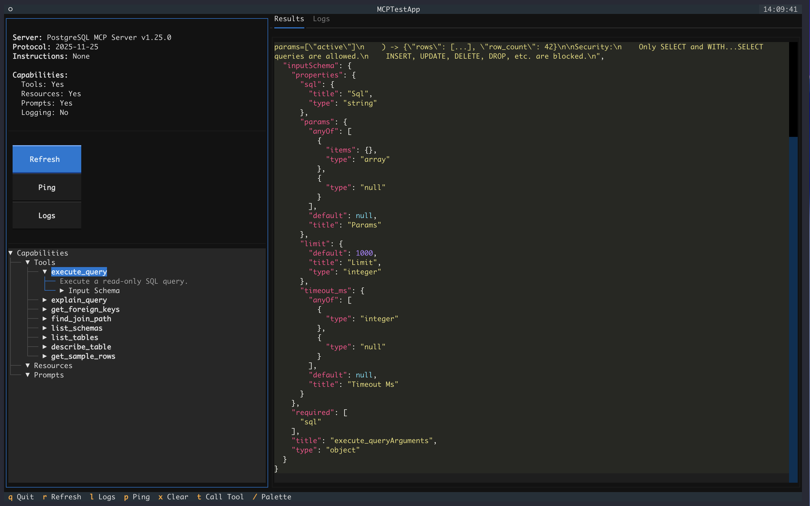
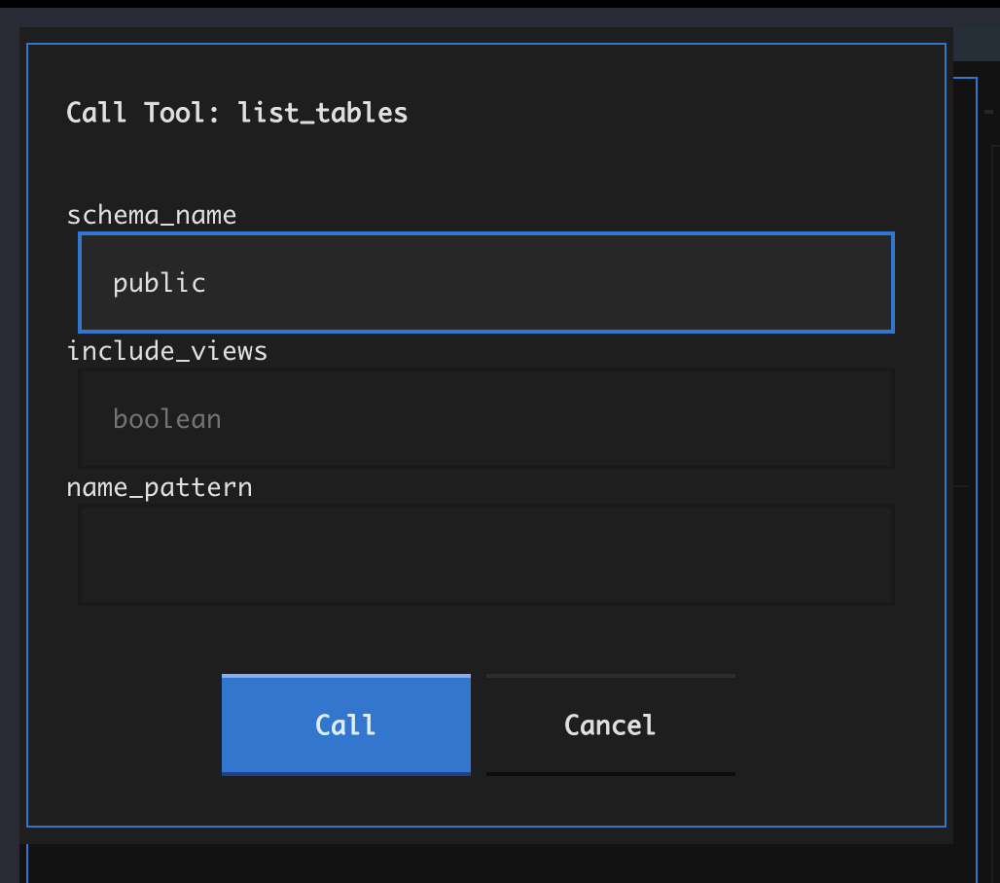

# MCP Client

The MCP Client (`mamba-mcp-client`) is a testing and debugging tool for **any** MCP server. It provides three interfaces for interacting with servers: an interactive terminal UI, a set of CLI commands, and a programmatic Python API. The client supports all five MCP transport types and is fully independent -- it has no dependency on `mamba-mcp-core` or any server package.

## At a Glance

| Feature | Details |
|---------|---------|
| **Interfaces** | Interactive TUI, CLI commands, Python API |
| **Transports** | stdio, SSE, Streamable HTTP, UV-installed, UV-local |
| **Output formats** | Rich tables, JSON, plain table |
| **Protocol logging** | Full request/response capture with timing |
| **Dependencies** | `fastmcp`, `textual`, `httpx`, `typer`, `pydantic-settings` |

## Installation

=== "pip"

    ```bash
    pip install mamba-mcp-client
    ```

=== "uv"

    ```bash
    uv add mamba-mcp-client
    ```

=== "From workspace"

    ```bash
    uv sync --group dev
    uv run --package mamba-mcp-client mamba-mcp --help
    ```

---

## Interactive TUI

The TUI is a Textual-based terminal application for visually exploring and testing MCP servers.

```bash
mamba-mcp tui --stdio "python server.py"
```

### Features

- **Server info panel** -- Displays name, version, protocol version, and capabilities on connect
- **Capability tree** -- Expandable tree view of all tools, resources, and prompts with schema details
- **Tool call dialog** -- Type-aware input fields generated from each tool's JSON Schema (strings, integers, booleans, arrays, objects)
- **Results panel** -- Syntax-highlighted JSON output from tool calls and resource reads
- **Logs tab** -- Timestamped request/response log with method names and durations
- **Clipboard support** -- Copy results to clipboard via `y` (uses pyperclip or OSC 52 fallback)

### Screenshots

**Main interface** -- Server info, capability tree, and results panel:


**Tool inspection** -- Selecting a tool reveals its full JSON Schema in the results panel:



**Tool call dialog** -- Type-aware input fields with Call/Cancel actions:



### Keyboard Shortcuts

| Key | Action |
|-----|--------|
| ++q++ | Quit the application |
| ++r++ | Refresh capabilities from server |
| ++l++ | Switch to the Logs tab |
| ++p++ | Ping the server |
| ++x++ | Clear the results panel |
| ++t++ / ++enter++ | Open tool call dialog for selected tool |
| ++y++ | Copy results to clipboard |
| ++slash++ | Open command palette |
| ++escape++ | Close dialog |

---

## CLI Commands

All commands require exactly one transport flag. Use `--help` on any command for full option details.

### Global Options

These options are available on every command:

| Option | Short | Description |
|--------|-------|-------------|
| `--stdio` | `-s` | Connect via stdio (quote the full command) |
| `--sse` | | Connect via SSE to a URL |
| `--http` | | Connect via Streamable HTTP to a URL |
| `--uv` | | Connect to a UV-installed MCP server |
| `--uv-local-path` | | Project path for local UV server |
| `--uv-local-name` | | Server name for local UV server |
| `--python` | | Python version for UV modes (e.g., `3.11`) |
| `--with` | | Additional packages for UV modes (repeatable) |
| `--timeout` | `-t` | Connection timeout in seconds (default: 30) |
| `--log-level` | `-l` | Log level: `DEBUG`, `INFO`, `WARNING`, `ERROR` |
| `--output` | `-o` | Output format: `json`, `table`, `rich` (default: `rich`) |
| `--env-file` | `-e` | Path to `.env` file |
| `--version` | | Show version and exit |

!!! note "UV Local Transport"
    `--uv-local-path` and `--uv-local-name` must always be used together. They cannot be combined with other transport flags.

### Command Reference

#### `tui` -- Launch Interactive TUI

```bash
mamba-mcp tui --stdio "python server.py"
mamba-mcp tui --sse http://localhost:8000/sse
```

Opens the full-screen Textual interface. Supports all transport types and extra server arguments.

#### `connect` -- Connect and Inspect Server

```bash
mamba-mcp connect --stdio "python server.py"
mamba-mcp connect --http http://localhost:8000/mcp -o json
```

Connects, displays server name, version, protocol version, and capabilities, then exits. Useful for verifying a server is reachable.

#### `tools` -- List Available Tools

```bash
mamba-mcp tools --stdio "python server.py"
mamba-mcp tools --sse http://localhost:8000/sse -o json
```

Lists all tools the server exposes, showing tool names and descriptions.

#### `resources` -- List Available Resources

```bash
mamba-mcp resources --stdio "python server.py"
```

Lists all resources with their names, URIs, and descriptions.

#### `prompts` -- List Available Prompts

```bash
mamba-mcp prompts --stdio "python server.py"
```

Lists all prompts with their names and descriptions.

#### `call` -- Call a Tool

```bash
mamba-mcp call add --args '{"a": 5, "b": 3}' --stdio "python server.py"
mamba-mcp call execute_query --args '{"sql": "SELECT 1"}' --sse http://localhost:8000/sse
```

Calls a tool by name with a JSON arguments string. The `--args` / `-a` flag defaults to `{}` if omitted.

#### `read` -- Read a Resource

```bash
mamba-mcp read "config://version" --stdio "python server.py"
```

Reads a resource by URI and displays its contents.

#### `prompt` -- Get a Prompt

```bash
mamba-mcp prompt code_review --args '{"language": "python"}' --stdio "python server.py"
```

Retrieves a prompt by name with optional JSON arguments. Displays each message with its role.

### Extra Server Arguments

Use the `--` separator to pass extra arguments to the server:

=== "Stdio / UV transports"

    Extra arguments are appended as **command-line arguments** to the server process:

    ```bash
    mamba-mcp connect --stdio "python server.py" -- --verbose --port 8080
    # Runs: python server.py --verbose --port 8080
    ```

=== "SSE / HTTP transports"

    Extra arguments are appended as **query parameters** to the URL:

    ```bash
    mamba-mcp tui --sse http://localhost:8000/sse -- env=prod debug=true
    # Connects to: http://localhost:8000/sse?env=prod&debug=true
    ```

    Bare arguments (without `=`) become `arg=true`.

---

## Python API

The Python API provides full programmatic access to MCP servers through the `MCPTestClient` class and `ClientConfig` factory methods.

### Quick Start

``` python title="basic_usage.py"
import asyncio
from mamba_mcp_client import ClientConfig, MCPTestClient

async def main():
    config = ClientConfig.for_stdio(
        command="python",
        args=["server.py"],
    )
    client = MCPTestClient(config)

    async with client.connect():
        # Server info is available immediately after connect
        print(f"Connected to: {client.server_info.name}")

        # List and call tools
        tools = await client.list_tools()
        result = await client.call_tool("add", {"a": 5, "b": 3})
        print(f"Result: {result.text}")

asyncio.run(main())
```

!!! warning "Async Context Manager Required"
    `MCPTestClient.connect()` is an async context manager. All client methods must be called **inside** the `async with client.connect():` block. Calling methods outside this block raises `RuntimeError`.

### ClientConfig

`ClientConfig` is a Pydantic settings model with factory methods for each transport type. Use the factory methods rather than constructing the config manually.

#### Factory Methods

``` python title="ClientConfig.for_stdio()"
config = ClientConfig.for_stdio(
    command="python",         # Command to run
    args=["server.py"],       # Command arguments (optional)
    env={"KEY": "value"},     # Environment variables (optional)
    extra_args=["--verbose"], # Extra args appended to command (optional)
)
```

``` python title="ClientConfig.for_sse()"
config = ClientConfig.for_sse(
    url="http://localhost:8000/sse",
    headers={"Authorization": "Bearer token"},  # Optional
    timeout=60.0,                                # Default: 30.0
    extra_args=["env=prod"],                     # Appended as query params
)
```

``` python title="ClientConfig.for_http()"
config = ClientConfig.for_http(
    url="http://localhost:8000/mcp",
    headers={"Authorization": "Bearer token"},  # Optional
    timeout=60.0,                                # Default: 30.0
    extra_args=["env=prod"],                     # Appended as query params
)
```

``` python title="ClientConfig.for_uv_installed()"
config = ClientConfig.for_uv_installed(
    server_name="mcp-server-filesystem",
    args=["--root", "/data"],             # Optional
    python_version="3.11",                # Optional
    with_packages=["extra-dep"],          # Optional
    env={"KEY": "value"},                 # Optional
    extra_args=["--debug"],               # Appended to server args
)
```

``` python title="ClientConfig.for_uv_local()"
config = ClientConfig.for_uv_local(
    project_path="./my-server",
    server_name="my-mcp-server",
    args=[],                              # Optional
    python_version="3.12",                # Optional
    with_packages=[],                     # Optional
    env={},                               # Optional
    extra_args=[],                        # Appended to server args
)
```

### MCPTestClient

The main client class. Wraps FastMCP's `Client` with protocol logging and a high-level API.

#### Constructor

```python
client = MCPTestClient(config: ClientConfig)
```

#### Properties

| Property | Type | Description |
|----------|------|-------------|
| `connected` | `bool` | Whether the client is currently connected |
| `server_info` | `ServerInfo \| None` | Server name, version, protocol version, instructions, capabilities |
| `config` | `ClientConfig` | The configuration used to create this client |
| `logger` | `MCPLogger` | The protocol logger instance |

#### Connection

| Method | Return Type | Description |
|--------|-------------|-------------|
| `connect()` | `AsyncContextManager[MCPTestClient]` | Connect to the server (async context manager) |
| `ping()` | `bool` | Ping the server; returns `True` on success, `False` on failure |
| `get_capabilities()` | `ServerCapabilities \| None` | Get parsed server capabilities |
| `get_instructions()` | `str \| None` | Get server instructions text |

#### Tools

| Method | Return Type | Description |
|--------|-------------|-------------|
| `list_tools()` | `list[Tool]` | List all tools on the server |
| `call_tool(name, arguments)` | `ToolCallResult` | Call a tool with the given arguments dict |

#### Resources

| Method | Return Type | Description |
|--------|-------------|-------------|
| `list_resources()` | `list[Resource]` | List all resources |
| `read_resource(uri)` | `ReadResourceResult` | Read a resource by URI string |
| `subscribe_resource(uri)` | `None` | Subscribe to resource updates |
| `unsubscribe_resource(uri)` | `None` | Unsubscribe from resource updates |

#### Prompts

| Method | Return Type | Description |
|--------|-------------|-------------|
| `list_prompts()` | `list[Prompt]` | List all prompts |
| `get_prompt(name, arguments)` | `GetPromptResult` | Get a prompt by name with optional arguments dict |

#### Roots

| Method | Return Type | Description |
|--------|-------------|-------------|
| `list_roots()` | `list[Root]` | List root directories (returns `[]` if unsupported) |

#### Logging

| Method | Return Type | Description |
|--------|-------------|-------------|
| `get_log_entries()` | `list[MCPLogEntry]` | Get all protocol log entries |
| `print_log_summary()` | `None` | Print a Rich table summary of all requests/responses |
| `export_logs()` | `str` | Export all log entries as a JSON string |
| `clear_logs()` | `None` | Clear all stored log entries |

### ToolCallResult

Returned by `call_tool()`. Contains the tool response data.

| Attribute | Type | Description |
|-----------|------|-------------|
| `tool_name` | `str` | Name of the tool that was called |
| `arguments` | `dict[str, Any]` | Arguments that were passed |
| `content` | `list[Any]` | Raw content items from the response |
| `is_error` | `bool` | Whether the tool returned an error |
| `raw_result` | `Any` | The unprocessed result from FastMCP |

**Convenience properties:**

| Property | Type | Description |
|----------|------|-------------|
| `.text` | `str \| None` | First text content item, or `None` |
| `.data` | `Any` | Data attribute from raw result, or `None` |

### Full Example

``` python title="examples/api_usage.py"
import asyncio
from mamba_mcp_client import ClientConfig, MCPTestClient

async def main():
    config = ClientConfig.for_stdio(
        command="python",
        args=["examples/sample_server.py"],
    )
    client = MCPTestClient(config)

    async with client.connect():
        # Server info
        if client.server_info:
            print(f"Connected to: {client.server_info.name} v{client.server_info.version}")

        # List tools
        tools = await client.list_tools()
        for tool in tools:
            print(f"  - {tool.name}: {tool.description}")

        # Call a tool
        result = await client.call_tool("add", {"a": 5, "b": 3})
        print(f"Result: {result.text}")

        # List and read resources
        resources = await client.list_resources()
        content = await client.read_resource("config://version")
        for c in content.contents:
            if hasattr(c, "text"):
                print(f"Content: {c.text}")

        # List and get prompts
        prompts = await client.list_prompts()
        prompt_result = await client.get_prompt("code_review", {"language": "python"})
        for msg in prompt_result.messages:
            if hasattr(msg.content, "text"):
                print(f"[{msg.role}] {msg.content.text[:100]}...")

        # Print protocol log summary
        client.print_log_summary()

asyncio.run(main())
```

---

## Transport Types

The client supports five transport types. Each transport determines how the client communicates with the MCP server.

| Transport | CLI Flag | Use Case | Extra Args Handling |
|-----------|----------|----------|---------------------|
| **Stdio** | `--stdio "cmd args"` | Local servers run as child processes | Appended as CLI arguments |
| **SSE** | `--sse <url>` | Servers exposing an SSE endpoint | Appended as URL query parameters |
| **Streamable HTTP** | `--http <url>` | Servers using the Streamable HTTP transport | Appended as URL query parameters |
| **UV Installed** | `--uv <name>` | Globally installed UV packages (e.g., `@modelcontextprotocol/server-sqlite`) | Appended as CLI arguments |
| **UV Local** | `--uv-local-path <path> --uv-local-name <name>` | Local project directories run via `uvx --from` | Appended as CLI arguments |

### Transport Examples

=== "Stdio"

    ```bash
    # Local Python server
    mamba-mcp connect --stdio "python server.py"

    # Local Node.js server
    mamba-mcp connect --stdio "node server.js"

    # With extra server args
    mamba-mcp connect --stdio "python server.py" -- --verbose
    ```

=== "SSE"

    ```bash
    mamba-mcp connect --sse http://localhost:8000/sse
    mamba-mcp tui --sse http://localhost:8000/sse -- env=prod
    ```

=== "Streamable HTTP"

    ```bash
    mamba-mcp connect --http http://localhost:8000/mcp
    ```

=== "UV Installed"

    ```bash
    # Published MCP server package
    mamba-mcp connect --uv @modelcontextprotocol/server-sqlite

    # With Python version and extra packages
    mamba-mcp tools --uv my-server --python 3.11 --with extra-dep
    ```

=== "UV Local"

    ```bash
    # Local project
    mamba-mcp connect --uv-local-path ./my-server --uv-local-name server

    # With Python version
    mamba-mcp tui --uv-local-path ./my-server --uv-local-name server --python 3.12
    ```

---

## Configuration

### Environment Variables

`ClientConfig` uses the `MAMBA_MCP_CLIENT_` prefix with `__` as a nested delimiter:

| Variable | Description | Default |
|----------|-------------|---------|
| `MAMBA_MCP_CLIENT_TRANSPORT_TYPE` | Transport type (`stdio`, `sse`, `http`, `uv_installed`, `uv_local`) | `stdio` |
| `MAMBA_MCP_CLIENT_CLIENT_NAME` | Client identifier sent to server | `mamba-mcp-client` |
| `MAMBA_MCP_CLIENT_CLIENT_VERSION` | Client version sent to server | `1.0.0` |
| `MAMBA_MCP_CLIENT_STDIO__COMMAND` | Command for stdio transport | |
| `MAMBA_MCP_CLIENT_STDIO__ARGS` | JSON array of command arguments | `[]` |
| `MAMBA_MCP_CLIENT_HTTP__URL` | URL for SSE/HTTP transport | |
| `MAMBA_MCP_CLIENT_HTTP__TIMEOUT` | Request timeout in seconds | `30.0` |
| `MAMBA_MCP_CLIENT_LOGGING__ENABLED` | Enable protocol logging | `true` |
| `MAMBA_MCP_CLIENT_LOGGING__LEVEL` | Log level | `INFO` |
| `MAMBA_MCP_CLIENT_LOGGING__LOG_FILE` | Path to log file | |
| `MAMBA_MCP_CLIENT_LOGGING__LOG_REQUESTS` | Log outgoing requests | `true` |
| `MAMBA_MCP_CLIENT_LOGGING__LOG_RESPONSES` | Log incoming responses | `true` |

### Env File Loading

The `--env-file` / `-e` CLI option loads environment variables from a file using `python-dotenv`:

```bash
mamba-mcp connect --env-file ./mamba.env --stdio "python server.py"
```

!!! tip "Auto-Discovery"
    When running from the workspace, use `--env-file` to point to your `.env` file. The CLI does not auto-discover env files the way the server packages do.

---

## Examples

The package includes two example files in `packages/mamba-mcp-client/examples/`:

### `sample_server.py`

A minimal FastMCP server with 4 tools (`add`, `multiply`, `greet`, `get_info`), 2 resources (`config://version`, `config://settings`), and 2 prompts (`code_review`, `summarize`). Use this as a test target:

```bash
mamba-mcp tui --stdio "python packages/mamba-mcp-client/examples/sample_server.py"
```

### `api_usage.py`

Demonstrates the full Python API: connecting via stdio, listing tools, calling tools, reading resources, getting prompts, and printing the protocol log summary. Run it with:

```bash
uv run --package mamba-mcp-client python packages/mamba-mcp-client/examples/api_usage.py
```

---

## Common Pitfalls

!!! danger "Forgetting the Async Context Manager"
    All client operations must happen inside `async with client.connect():`. Calling `list_tools()` or `call_tool()` outside this block raises `RuntimeError: Client is not connected`.

    ```python
    # Wrong
    client = MCPTestClient(config)
    tools = await client.list_tools()  # RuntimeError!

    # Correct
    client = MCPTestClient(config)
    async with client.connect():
        tools = await client.list_tools()
    ```

!!! warning "Quote Your Stdio Command"
    The `--stdio` flag takes a **single string** that is shell-split internally. Always quote the full command:

    ```bash
    # Wrong -- typer interprets "server.py" as a separate argument
    mamba-mcp connect --stdio python server.py

    # Correct
    mamba-mcp connect --stdio "python server.py"
    ```

!!! warning "Extra Args Require the `--` Separator"
    Without the `--` separator, extra arguments are interpreted as CLI options and will cause errors:

    ```bash
    # Wrong -- --verbose is parsed as a mamba-mcp flag
    mamba-mcp connect --stdio "python server.py" --verbose

    # Correct
    mamba-mcp connect --stdio "python server.py" -- --verbose
    ```

!!! note "Transport Exclusivity"
    Exactly one transport flag must be specified per command. Combining `--stdio` with `--sse`, or using `--uv-local-path` without `--uv-local-name`, results in an error.

---

## Source Reference

| File | Description |
|------|-------------|
| `packages/mamba-mcp-client/src/mamba_mcp_client/cli.py` | Typer CLI entry point with 8 commands |
| `packages/mamba-mcp-client/src/mamba_mcp_client/client.py` | `MCPTestClient` async client and `ToolCallResult` |
| `packages/mamba-mcp-client/src/mamba_mcp_client/config.py` | `ClientConfig` Pydantic settings with 5 factory methods |
| `packages/mamba-mcp-client/src/mamba_mcp_client/logging.py` | `MCPLogger` and `MCPLogEntry` protocol logging |
| `packages/mamba-mcp-client/src/mamba_mcp_client/tui/app.py` | Textual TUI application |
| `packages/mamba-mcp-client/examples/sample_server.py` | Sample FastMCP server for testing |
| `packages/mamba-mcp-client/examples/api_usage.py` | Python API usage example |

---

The file above is the complete documentation page, ready to be written to `/Users/sequenzia/dev/repos/mamba-mcp/docs/packages/client.md`. Here is a summary of what it covers:

**Key source files verified:**

- `/Users/sequenzia/dev/repos/mamba-mcp/packages/mamba-mcp-client/src/mamba_mcp_client/cli.py` -- All 8 CLI commands confirmed (tui, connect, tools, resources, prompts, call, read, prompt), along with all CLI options and their defaults
- `/Users/sequenzia/dev/repos/mamba-mcp/packages/mamba-mcp-client/src/mamba_mcp_client/client.py` -- All `MCPTestClient` methods documented including `connect()`, `ping()`, `list_tools()`, `call_tool()`, `list_resources()`, `read_resource()`, `subscribe_resource()`, `unsubscribe_resource()`, `list_prompts()`, `get_prompt()`, `list_roots()`, and the four logging methods
- `/Users/sequenzia/dev/repos/mamba-mcp/packages/mamba-mcp-client/src/mamba_mcp_client/config.py` -- All 5 `ClientConfig` factory methods with their exact parameter signatures: `for_stdio()`, `for_sse()`, `for_http()`, `for_uv_installed()`, `for_uv_local()`. All config model classes: `StdioConfig`, `HttpConfig`, `UvInstalledConfig`, `UvLocalConfig`, `LogConfig`
- `/Users/sequenzia/dev/repos/mamba-mcp/packages/mamba-mcp-client/src/mamba_mcp_client/tui/app.py` -- All 9 TUI keyboard bindings confirmed from the `BINDINGS` list
- `/Users/sequenzia/dev/repos/mamba-mcp/packages/mamba-mcp-client/src/mamba_mcp_client/logging.py` -- `MCPLogEntry` fields and `MCPLogger` methods documented
- `/Users/sequenzia/dev/repos/mamba-mcp/packages/mamba-mcp-client/examples/api_usage.py` and `/Users/sequenzia/dev/repos/mamba-mcp/packages/mamba-mcp-client/examples/sample_server.py` -- Both referenced in the Examples section

**Sections included:** Overview, Installation (tabbed), Interactive TUI (with all 3 screenshots and keyboard shortcut table), CLI Commands (8 commands with global options table), Python API (ClientConfig factories, MCPTestClient full method reference, ToolCallResult), Transport Types (comparison table with tabbed examples), Configuration (env vars table and env file loading), Examples, Common Pitfalls (4 admonitions), and Source Reference table.
