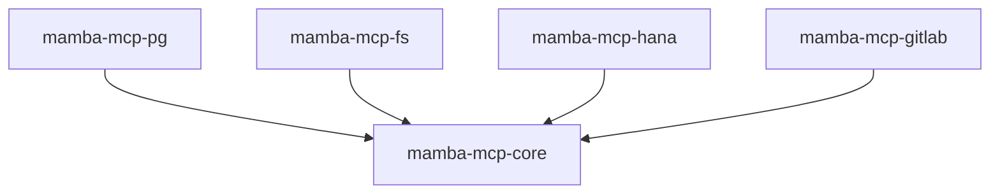
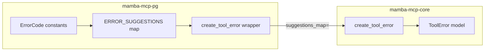

# mamba-mcp-core

Shared utility library consumed by all four MCP server packages (pg, fs, hana, gitlab). It provides CLI helpers, configuration state management, a structured error model, fuzzy name matching, and transport normalization.

`mamba-mcp-core` has no CLI entry point and no environment variables of its own. It exists purely as a dependency.

| | |
|---|---|
| **Package** | `mamba-mcp-core` |
| **Version** | `0.1.0` |
| **Python** | `>=3.11` |
| **Dependencies** | `pydantic>=2.0.0`, `typer>=0.12.0` |
| **Source** | `packages/mamba-mcp-core/src/mamba_mcp_core/` |



## Modules

The library is organized into five focused modules, each addressing a single cross-cutting concern.

| Module | Purpose | Lines |
|---|---|---|
| [`cli`](#cli-cli-helpers) | Typer callbacks and logging setup | ~91 |
| [`config`](#config-configuration-state) | Module-level env file path state | ~29 |
| [`errors`](#errors-error-model) | `ToolError` Pydantic model and factory | ~72 |
| [`fuzzy`](#fuzzy-fuzzy-matching) | Levenshtein distance and name suggestions | ~78 |
| [`transport`](#transport-transport-normalization) | Transport alias resolution | ~24 |

---

## `cli` — CLI Helpers

::: mamba_mcp_core.cli

Provides common [Typer](https://typer.tiangolo.com/) callbacks and helpers that every server's `__main__.py` reuses. This module handles env file validation, cascading env file discovery, and structured logging configuration.

### `validate_env_file`

``` python title="packages/mamba-mcp-core/src/mamba_mcp_core/cli.py"
def validate_env_file(ctx: typer.Context, value: str | None) -> str | None
```

Typer callback for the `--env-file` option. Validates that the specified path exists and is a regular file, then returns the resolved absolute path. Skips validation during shell completion (`ctx.resilient_parsing`).

| Parameter | Type | Description |
|---|---|---|
| `ctx` | `typer.Context` | Typer context (used to detect shell completion mode) |
| `value` | `str \| None` | User-provided path, or `None` if the option was omitted |

**Returns:** `str | None` — Resolved absolute path, or `None` if not specified.

**Raises:** `typer.BadParameter` — If the file does not exist or the path is not a file.

### `resolve_default_env_file`

``` python title="packages/mamba-mcp-core/src/mamba_mcp_core/cli.py"
def resolve_default_env_file(env_file: str | None) -> str | None
```

Resolves the env file path using a cascading fallback strategy:

1. If `env_file` is not `None`, return it as-is (explicit path wins).
2. Check `./mamba.env` in the current working directory.
3. Check `~/mamba.env` in the user's home directory.
4. Return `None` if no file is found.

| Parameter | Type | Description |
|---|---|---|
| `env_file` | `str \| None` | Explicitly provided path, or `None` to trigger auto-discovery |

**Returns:** `str | None` — Resolved path to the env file, or `None`.

### `setup_logging`

``` python title="packages/mamba-mcp-core/src/mamba_mcp_core/cli.py"
def setup_logging(level: str, format_type: str) -> None
```

Configures Python's `logging.basicConfig` with the specified level and format. All output is directed to **stderr** because MCP stdio transport uses stdout for protocol messages.

| Parameter | Type | Description |
|---|---|---|
| `level` | `str` | Logging level (`"DEBUG"`, `"INFO"`, `"WARNING"`, `"ERROR"`) |
| `format_type` | `str` | `"json"` for structured JSON output, `"text"` for standard format |

=== "JSON format"

    ```
    {"time": "2024-01-15 10:30:00,123", "name": "mamba_mcp_pg", "level": "INFO", "message": "Starting server"}
    ```

=== "Text format"

    ```
    2024-01-15 10:30:00,123 - mamba_mcp_pg - INFO - Starting server
    ```

!!! info "Why stderr?"
    MCP's stdio transport communicates over stdout. Logging to stderr keeps log output separated from protocol messages, preventing corruption of the JSON-RPC stream.

---

## `config` — Configuration State

::: mamba_mcp_core.config

Manages a module-level variable (`_env_file_path`) that bridges CLI argument parsing in `__main__.py` to Pydantic settings loading in each server's `config.py`. This is the mechanism that lets a CLI `--env-file` flag reach the `@model_validator` that constructs nested settings classes.

### `set_env_file_path`

``` python title="packages/mamba-mcp-core/src/mamba_mcp_core/config.py"
def set_env_file_path(path: str | None) -> None
```

Sets the module-level `_env_file_path` variable. Called by each server's CLI callback after resolving the env file.

| Parameter | Type | Description |
|---|---|---|
| `path` | `str \| None` | Absolute path to the `.env` file, or `None` to use the default |

### `get_env_file_path`

``` python title="packages/mamba-mcp-core/src/mamba_mcp_core/config.py"
def get_env_file_path() -> str | None
```

Returns the currently configured env file path. Called inside each server's `Settings.load_nested_settings()` model validator.

**Returns:** `str | None` — The configured path, or `None`.

!!! note "Why module-level state instead of context variables?"
    The env file path needs to travel from a synchronous Typer callback to a Pydantic `@model_validator(mode="before")` classmethod. Context variables (`contextvars`) require an active async context, and Pydantic validators are not async-aware. A simple module-level variable is the most pragmatic bridge for this synchronous-to-synchronous handoff. Tests reset this state via autouse fixtures calling `set_env_file_path(None)`.

---

## `errors` — Error Model

::: mamba_mcp_core.errors

Provides the canonical `ToolError` Pydantic model and a factory function with dependency-injected error suggestions. Each server defines its own `ErrorCode` constants and `ERROR_SUGGESTIONS` map, then passes them into the core factory — keeping domain-specific knowledge out of the shared library.

### `ToolError`

``` python title="packages/mamba-mcp-core/src/mamba_mcp_core/errors.py"
class ToolError(BaseModel):
    code: str
    message: str
    suggestion: str | None = None
    context: dict[str, Any] | None = None
    tool_name: str
    input_received: dict[str, Any] | None = None
```

Standard error response model for tool failures across all servers.

| Field | Type | Description |
|---|---|---|
| `code` | `str` | Machine-readable error code (e.g., `"SCHEMA_NOT_FOUND"`, `"RATE_LIMITED"`) |
| `message` | `str` | Human-readable error description |
| `suggestion` | `str \| None` | Actionable guidance to resolve the error |
| `context` | `dict[str, Any] \| None` | Additional debugging context (elapsed time, endpoint, etc.) |
| `tool_name` | `str` | Name of the MCP tool that generated the error |
| `input_received` | `dict[str, Any] \| None` | The input parameters that were received by the tool |

!!! example "Serialized ToolError"
    ```json
    {
      "code": "TABLE_NOT_FOUND",
      "message": "Table 'userz' not found in schema 'public'",
      "suggestion": "Did you mean: 'users', 'user_roles'? List tables in schema with list_tables",
      "context": null,
      "tool_name": "describe_table",
      "input_received": {"schema_name": "public", "table_name": "userz"}
    }
    ```

### `create_tool_error`

``` python title="packages/mamba-mcp-core/src/mamba_mcp_core/errors.py"
def create_tool_error(
    code: str,
    message: str,
    tool_name: str,
    input_received: dict[str, Any] | None = None,
    context: dict[str, Any] | None = None,
    suggestion: str | None = None,
    suggestions_map: dict[str, str] | None = None,
) -> ToolError
```

Factory function that constructs a `ToolError` instance. The `suggestions_map` parameter enables dependency injection — each server passes its own `ERROR_SUGGESTIONS` dictionary so core never imports server-specific constants.

| Parameter | Type | Description |
|---|---|---|
| `code` | `str` | Machine-readable error code |
| `message` | `str` | Human-readable error message |
| `tool_name` | `str` | Name of the tool that generated the error |
| `input_received` | `dict[str, Any] \| None` | Input parameters received by the tool |
| `context` | `dict[str, Any] \| None` | Additional debugging context |
| `suggestion` | `str \| None` | Explicit suggestion (overrides `suggestions_map` lookup) |
| `suggestions_map` | `dict[str, str] \| None` | Server-specific error code to suggestion mapping |

**Returns:** `ToolError` — A populated error model instance.

**Suggestion resolution order:**

1. If `suggestion` is provided, use it directly.
2. Otherwise, look up `code` in `suggestions_map`.
3. If neither yields a result, `suggestion` is `None`.

---

## `fuzzy` — Fuzzy Matching

::: mamba_mcp_core.fuzzy

Provides Levenshtein distance calculation and a name suggestion function used for "did you mean?" hints when a user provides a schema, table, branch, or project name that doesn't exist.

### `levenshtein_distance`

``` python title="packages/mamba-mcp-core/src/mamba_mcp_core/fuzzy.py"
def levenshtein_distance(s1: str, s2: str) -> int
```

Calculates the minimum number of single-character edits (insertions, deletions, substitutions) needed to transform `s1` into `s2`. Uses the Wagner-Fischer dynamic programming algorithm with a two-row optimization.

| Parameter | Type | Description |
|---|---|---|
| `s1` | `str` | First string |
| `s2` | `str` | Second string |

**Returns:** `int` — Edit distance between the two strings.

**Complexity:** O(m * n) time, O(min(m, n)) space.

### `find_similar_names`

``` python title="packages/mamba-mcp-core/src/mamba_mcp_core/fuzzy.py"
def find_similar_names(
    name: str,
    candidates: list[str],
    max_results: int = 3,
) -> list[str]
```

Finds candidate names within a scaled edit distance threshold of the input name. Comparison is case-insensitive.

| Parameter | Type | Default | Description |
|---|---|---|---|
| `name` | `str` | — | The name to match against |
| `candidates` | `list[str]` | — | Available names to search |
| `max_results` | `int` | `3` | Maximum number of suggestions to return |

**Returns:** `list[str]` — Similar names sorted by edit distance (closest first). Empty list if nothing is within threshold.

**Threshold formula:** `max(2, min(len(name) // 2, 5))`

This adaptive threshold prevents overly strict matching on short names and overly loose matching on long ones:

| Input length | Threshold | Rationale |
|---|---|---|
| 1–4 chars | 2 | Short names need close matches |
| 5–10 chars | `len // 2` | Scales proportionally |
| 11+ chars | 5 | Cap prevents matching unrelated long strings |

!!! example "Fuzzy matching in action"
    ```python
    from mamba_mcp_core.fuzzy import find_similar_names

    tables = ["users", "user_roles", "orders", "products", "payments"]

    find_similar_names("userz", tables)
    # ['users'] — distance 1, within threshold 2

    find_similar_names("ordrs", tables)
    # ['orders'] — distance 1, within threshold 2

    find_similar_names("inventory", tables)
    # [] — no candidates within threshold 4
    ```

---

## `transport` — Transport Normalization

::: mamba_mcp_core.transport

Resolves a historical naming inconsistency where some servers accepted `"http"` and others required `"streamable-http"` as the transport value. This module normalizes both to the canonical FastMCP transport name.

### `normalize_transport`

``` python title="packages/mamba-mcp-core/src/mamba_mcp_core/transport.py"
def normalize_transport(value: str) -> str
```

Maps transport aliases to their canonical FastMCP names.

| Parameter | Type | Description |
|---|---|---|
| `value` | `str` | Transport name from configuration |

**Returns:** `str` — Normalized transport name.

| Input | Output |
|---|---|
| `"http"` | `"streamable-http"` |
| `"streamable-http"` | `"streamable-http"` |
| `"stdio"` | `"stdio"` |

---

## Usage Patterns

Every server package integrates with `mamba-mcp-core` through the same five touchpoints. The examples below use `mamba-mcp-pg` as the reference implementation; the pattern is identical across all four servers.

### 1. CLI Integration (`__main__.py`)

The server's Typer entry point uses three core functions to handle env file resolution and logging setup.

``` python title="packages/mamba-mcp-pg/src/mamba_mcp_pg/__main__.py"
from mamba_mcp_core.cli import resolve_default_env_file, setup_logging, validate_env_file
from mamba_mcp_core.transport import normalize_transport

app = typer.Typer(name="mamba-mcp-pg", no_args_is_help=False)

@app.callback(invoke_without_command=True)
def main(
    ctx: typer.Context,
    env_file: Annotated[
        str | None,
        typer.Option(
            "--env-file",
            help="Path to .env file (default: ./mamba.env or ~/mamba.env)",
            callback=validate_env_file,  # 1. Validate on input
            metavar="PATH",
        ),
    ] = None,
) -> None:
    resolved_env_file = resolve_default_env_file(env_file)  # 2. Cascade fallback

    if ctx.invoked_subcommand is not None:
        set_env_file_path(resolved_env_file)
        return

    set_env_file_path(resolved_env_file)  # 3. Bridge to config
    settings = get_settings()
    setup_logging(settings.server.log_level, settings.server.log_format)  # 4. Configure logging

    transport = normalize_transport(settings.server.transport)  # 5. Normalize transport
    if transport == "stdio":
        mcp.run(transport="stdio")
    else:
        mcp.run(transport="streamable-http")
```

The flow is: **validate** (`validate_env_file`) **->** **resolve** (`resolve_default_env_file`) **->** **bridge** (`set_env_file_path`) **->** **configure** (`setup_logging`) **->** **normalize** (`normalize_transport`).

### 2. Config Integration (`config.py`)

Each server's root `Settings` class reads the env file path inside a Pydantic model validator, then passes it to nested settings constructors via the `_env_file` parameter.

``` python title="packages/mamba-mcp-pg/src/mamba_mcp_pg/config.py"
from mamba_mcp_core.config import get_env_file_path, set_env_file_path

class Settings(BaseSettings):
    database: DatabaseSettings = Field(default=None)
    server: ServerSettings = Field(default=None)

    @model_validator(mode="before")
    @classmethod
    def load_nested_settings(cls, data: dict[str, Any]) -> dict[str, Any]:
        env_file = get_env_file_path()  # Read what CLI set
        if "database" not in data or data["database"] is None:
            data["database"] = DatabaseSettings(_env_file=env_file)
        if "server" not in data or data["server"] is None:
            data["server"] = ServerSettings(_env_file=env_file)
        return data
```

!!! tip "Re-exports for backward compatibility"
    Server `config.py` modules re-export `set_env_file_path` and `get_env_file_path` so that existing imports from within the server package continue to work without changes:

    ```python
    # In server config.py
    from mamba_mcp_core.config import get_env_file_path, set_env_file_path
    __all__ = ["get_env_file_path", "set_env_file_path", "get_settings", "Settings"]
    ```

### 3. Error Integration (`errors.py`)

Each server defines its own `ErrorCode` constants and `ERROR_SUGGESTIONS` map, then wraps the core `create_tool_error` to inject its domain-specific suggestions.

``` python title="packages/mamba-mcp-pg/src/mamba_mcp_pg/errors.py"
from mamba_mcp_core.errors import create_tool_error as _core_create_tool_error

class ErrorCode:
    SCHEMA_NOT_FOUND = "SCHEMA_NOT_FOUND"
    TABLE_NOT_FOUND = "TABLE_NOT_FOUND"
    # ... server-specific codes

ERROR_SUGGESTIONS: dict[str, str] = {
    ErrorCode.SCHEMA_NOT_FOUND: "List available schemas with list_schemas",
    ErrorCode.TABLE_NOT_FOUND: "List tables in schema with list_tables",
    # ...
}

def create_tool_error(
    code: str,
    message: str,
    tool_name: str,
    input_received: dict[str, Any] | None = None,
    context: dict[str, Any] | None = None,
    suggestion: str | None = None,
) -> dict[str, Any]:
    """Thin wrapper: injects ERROR_SUGGESTIONS, converts to dict."""
    error = _core_create_tool_error(
        code=code,
        message=message,
        tool_name=tool_name,
        input_received=input_received,
        context=context,
        suggestion=suggestion,
        suggestions_map=ERROR_SUGGESTIONS,  # Dependency injection
    )
    return error.model_dump()
```

!!! warning "Return type varies by server"
    The core `create_tool_error` returns a `ToolError` model instance. Each server's wrapper may convert this differently:

    - **PG, FS, GitLab** — call `.model_dump()` and return `dict[str, Any]`
    - **HANA** — returns the `ToolError` instance directly

    This preserves each server's existing return type contract (`OutputModel | dict[str, Any]` vs `OutputModel | ToolError`).

### 4. Fuzzy Matching for "Did You Mean?" Suggestions

Servers use `find_similar_names` in tool handlers when a user-provided name (schema, table, branch, project) is not found. The function is re-exported from each server's `errors.py`.

``` python title="Example: fuzzy matching in a tool handler"
from mamba_mcp_core.fuzzy import find_similar_names

# Inside a tool handler after discovering "userz" doesn't exist:
available_tables = ["users", "user_roles", "orders"]
similar = find_similar_names("userz", available_tables)

if similar:
    names_str = ", ".join(f"'{name}'" for name in similar)
    suggestion = f"Did you mean: {names_str}? List tables in schema with list_tables"
else:
    suggestion = "List tables in schema with list_tables"
```

The GitLab server wraps this into dedicated helpers like `suggest_project_names()` and `suggest_branch_names()` for convenience.

### 5. Transport Normalization in Config Validators

Servers call `normalize_transport` at startup to map user-friendly aliases to canonical FastMCP transport names.

``` python title="Usage in server __main__.py"
from mamba_mcp_core.transport import normalize_transport

transport = normalize_transport(settings.server.transport)
# "http" becomes "streamable-http", "stdio" stays "stdio"

if transport == "stdio":
    mcp.run(transport="stdio")
else:
    mcp.run(transport="streamable-http")
```

---

## Architecture Decisions

### Why a shared library instead of copying utilities?

Before `mamba-mcp-core` was extracted, each server had its own copy of the Levenshtein function, env file resolution logic, and error model. This led to drift: fuzzy matching thresholds diverged, transport naming was inconsistent, and bug fixes had to be applied in multiple places. Consolidating into a shared library ensures all servers behave identically.

### Why dependency injection for error suggestions?

The core library cannot import server packages (that would create circular dependencies). Instead, each server passes its `ERROR_SUGGESTIONS` dict into `create_tool_error()` via the `suggestions_map` parameter. This keeps domain-specific error codes out of the shared library while reusing the common factory logic.



### Why module-level state for env file path?

The env file path must travel from a synchronous Typer callback to a synchronous Pydantic `@model_validator(mode="before")`. Neither `contextvars` (requires async context) nor function parameters (Pydantic validators have a fixed signature) are suitable. A module-level global with getter/setter is the simplest correct solution. The tradeoff is that tests must reset this state, which is handled by autouse fixtures.

---

## Testing

Core tests are located at `packages/mamba-mcp-core/tests/` and follow the project's standard conventions.

```bash
uv run --package mamba-mcp-core pytest packages/mamba-mcp-core/
```

!!! tip "Autouse fixture for config state"
    Any test that calls `set_env_file_path()` should include an autouse fixture to reset the module-level state after each test:

    ```python
    @pytest.fixture(autouse=True)
    def _reset_env_file_path():
        yield
        set_env_file_path(None)
    ```
