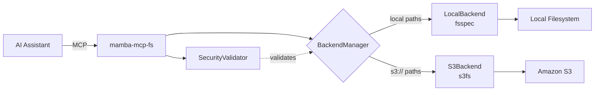
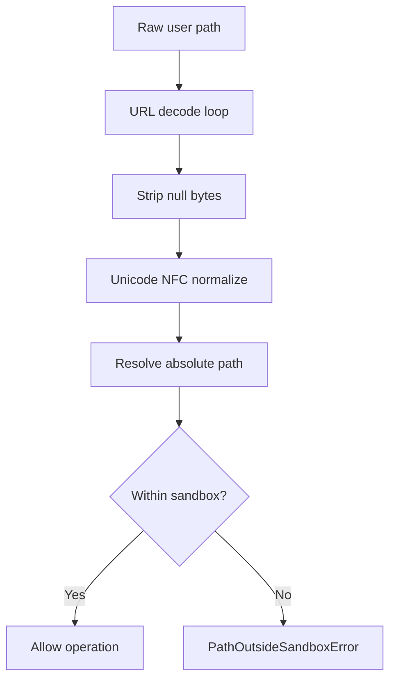

# Filesystem MCP Server

The Filesystem MCP Server (`mamba-mcp-fs`) provides AI assistants with secure, structured access to local and Amazon S3 filesystems through the Model Context Protocol. It exposes **12 MCP tools** across **3 layers** -- discovery, S3 extras, and mutation -- with defense-in-depth security including sandbox enforcement, path traversal prevention, symlink and hidden file policies, extension filtering, and rate limiting.

## Overview



| Feature | Details |
|---|---|
| **Tools** | 12 across 3 layers |
| **Backends** | Local filesystem (fsspec), Amazon S3 (s3fs) |
| **Security** | Sandbox enforcement, path traversal prevention, symlink/hidden policies, extension filtering |
| **Content detection** | MIME typing, text vs binary classification, 80+ extension mappings |
| **Large files** | Chunked reading via offset/limit, per-backend size limits |
| **Cross-backend** | Copy files between local and S3 in a single operation |
| **Transports** | STDIO (default), Streamable HTTP |

## Installation

```bash
pip install mamba-mcp-fs
```

!!! note "Workspace install"
    When developing within the Mamba MCP monorepo, use the workspace install instead:

    ```bash
    uv sync --group dev
    ```

## Quick Start

**1. Set your sandbox root** (the directory the server is allowed to access):

```bash
export MAMBA_MCP_FS_LOCAL_BASE_PATH=/path/to/sandbox
```

**2. Test connectivity:**

```bash
mamba-mcp-fs test
```

**3. Start the server:**

```bash
mamba-mcp-fs
```

**4. Or use an env file:**

```bash
mamba-mcp-fs --env-file mamba.env
```

The server auto-discovers a `mamba.env` file in the current working directory or home directory if `--env-file` is not provided.

## Configuration

Configuration is loaded from environment variables or a `.env` / `mamba.env` file. Settings are organized into three groups with distinct prefixes.

### Server Settings

Prefix: `MAMBA_MCP_FS_`

| Variable | Type | Default | Description |
|---|---|---|---|
| `TRANSPORT` | `str` | `stdio` | Transport type: `stdio`, `http`, or `streamable-http` |
| `SERVER_HOST` | `str` | `0.0.0.0` | HTTP server bind host |
| `SERVER_PORT` | `int` | `8080` | HTTP server bind port (1--65535) |
| `LOG_LEVEL` | `str` | `INFO` | Logging level |
| `LOG_FORMAT` | `str` | `json` | Log output format: `json` or `text` |
| `READ_ONLY` | `bool` | `true` | Disable mutation tools (Layer 3) when true |
| `RATE_LIMIT` | `int` | `0` | Max operations per minute; `0` disables rate limiting |
| `ALLOWED_EXTENSIONS` | `str` | _(none)_ | Comma-separated allowlist of file extensions (e.g., `.py,.json,.md`) |
| `DENIED_EXTENSIONS` | `str` | _(none)_ | Comma-separated denylist of file extensions (e.g., `.exe,.dll`) |

### Local Backend Settings

Prefix: `MAMBA_MCP_FS_LOCAL_`

| Variable | Type | Default | Description |
|---|---|---|---|
| `ENABLED` | `bool` | `true` | Enable local filesystem backend |
| `BASE_PATH` | `str` | _(required)_ | Sandbox root directory -- all local paths must resolve within this |
| `MAX_FILE_SIZE` | `int` | `10485760` | Maximum file size in bytes (default 10 MB) |
| `FOLLOW_SYMLINKS` | `bool` | `false` | Follow symbolic links (targets are validated to stay in sandbox) |
| `SHOW_HIDDEN` | `bool` | `false` | Show hidden files/dotfiles in directory listings |

### S3 Backend Settings

Prefix: `MAMBA_MCP_FS_S3_`

| Variable | Type | Default | Description |
|---|---|---|---|
| `ENABLED` | `bool` | `false` | Enable S3 backend |
| `BUCKET` | `str` | _(none)_ | Default S3 bucket name |
| `PREFIX` | `str` | `""` | Key prefix within the bucket (acts as S3 sandbox) |
| `REGION` | `str` | `us-east-1` | AWS region |
| `ENDPOINT_URL` | `str` | _(none)_ | Custom endpoint URL for MinIO, LocalStack, or other S3-compatible services |
| `MAX_FILE_SIZE` | `int` | `52428800` | Maximum file size in bytes (default 50 MB) |

!!! info "AWS Credentials"
    S3 authentication uses the standard AWS credential chain: environment variables (`AWS_ACCESS_KEY_ID`, `AWS_SECRET_ACCESS_KEY`), IAM roles, or AWS CLI profiles. No S3-specific credential settings are needed in the server config.

### Configuration Examples

=== "Local Only"

    ```ini title="mamba.env"
    # Local filesystem only (default)
    MAMBA_MCP_FS_LOCAL_BASE_PATH=/data/project
    MAMBA_MCP_FS_LOCAL_MAX_FILE_SIZE=20971520
    MAMBA_MCP_FS_LOCAL_SHOW_HIDDEN=false
    MAMBA_MCP_FS_LOCAL_FOLLOW_SYMLINKS=false
    MAMBA_MCP_FS_READ_ONLY=true
    ```

=== "S3 with AWS"

    ```ini title="mamba.env"
    # S3 backend with real AWS
    MAMBA_MCP_FS_LOCAL_ENABLED=false
    MAMBA_MCP_FS_LOCAL_BASE_PATH=/tmp/unused
    MAMBA_MCP_FS_S3_ENABLED=true
    MAMBA_MCP_FS_S3_BUCKET=my-data-bucket
    MAMBA_MCP_FS_S3_PREFIX=datasets/
    MAMBA_MCP_FS_S3_REGION=us-west-2
    MAMBA_MCP_FS_READ_ONLY=true
    ```

=== "S3 with LocalStack / MinIO"

    ```ini title="mamba.env"
    # Local S3-compatible service
    MAMBA_MCP_FS_LOCAL_ENABLED=false
    MAMBA_MCP_FS_LOCAL_BASE_PATH=/tmp/unused
    MAMBA_MCP_FS_S3_ENABLED=true
    MAMBA_MCP_FS_S3_BUCKET=test-bucket
    MAMBA_MCP_FS_S3_REGION=us-east-1
    MAMBA_MCP_FS_S3_ENDPOINT_URL=http://localhost:4566
    MAMBA_MCP_FS_READ_ONLY=false
    ```

=== "Dual Backend"

    ```ini title="mamba.env"
    # Both local and S3 active
    MAMBA_MCP_FS_LOCAL_ENABLED=true
    MAMBA_MCP_FS_LOCAL_BASE_PATH=/data/project
    MAMBA_MCP_FS_LOCAL_FOLLOW_SYMLINKS=true
    MAMBA_MCP_FS_S3_ENABLED=true
    MAMBA_MCP_FS_S3_BUCKET=project-assets
    MAMBA_MCP_FS_S3_REGION=eu-west-1
    MAMBA_MCP_FS_READ_ONLY=false
    MAMBA_MCP_FS_RATE_LIMIT=120
    MAMBA_MCP_FS_DENIED_EXTENSIONS=.exe,.dll,.so
    ```

## Tool Reference

### Layer 1 -- Discovery (Always Registered)

These read-only tools are always available, regardless of configuration. They provide filesystem browsing, file reading, and search capabilities.

#### `list_directory`

List files and directories at a given path with optional filtering.

**Parameters:**

| Parameter | Type | Default | Description |
|---|---|---|---|
| `path` | `str` | _(required)_ | Directory path to list. Supports local paths and `s3://bucket/prefix` paths |
| `backend` | `str \| null` | `null` | Force `local` or `s3` backend. Default: auto-detect from path |
| `include_hidden` | `bool \| null` | `null` | Include hidden files. Default: per `show_hidden` config |
| `pattern` | `str \| null` | `null` | Glob pattern to filter entries (e.g., `*.py`) |
| `max_entries` | `int` | `1000` | Maximum entries to return (1--10000) |

??? example "Example Response"

    ```json
    {
      "path": "/data/project",
      "backend": "local",
      "entries": [
        {
          "name": "README.md",
          "path": "/data/project/README.md",
          "type": "file",
          "size_bytes": 2048,
          "modified_at": "2025-01-15T10:30:00Z",
          "is_hidden": false
        },
        {
          "name": "src",
          "path": "/data/project/src",
          "type": "directory",
          "size_bytes": null,
          "modified_at": "2025-01-14T08:00:00Z",
          "is_hidden": false
        }
      ],
      "total_count": 2,
      "has_more": false
    }
    ```

---

#### `get_file_info`

Get detailed metadata for a single file or directory, including MIME type, permissions, symlink status, and optional SHA-256 checksum.

**Parameters:**

| Parameter | Type | Default | Description |
|---|---|---|---|
| `path` | `str` | _(required)_ | Path to the file or directory |
| `backend` | `str \| null` | `null` | Force `local` or `s3` backend. Default: auto-detect |
| `include_checksum` | `bool` | `false` | Calculate and include SHA-256 checksum |

??? example "Example Response"

    ```json
    {
      "path": "/data/project/report.csv",
      "backend": "local",
      "name": "report.csv",
      "type": "file",
      "size_bytes": 524288,
      "size_pretty": "512 KB",
      "mime_type": "text/csv",
      "modified_at": "2025-01-15T10:30:00Z",
      "created_at": "2025-01-10T14:00:00Z",
      "is_hidden": false,
      "is_symlink": false,
      "permissions": "-rw-r--r--",
      "checksum": null
    }
    ```

---

#### `read_file`

Read file contents with smart text/binary detection. Text files are returned as strings, binary files as base64. Supports chunked reading for large files.

**Parameters:**

| Parameter | Type | Default | Description |
|---|---|---|---|
| `path` | `str` | _(required)_ | Path to the file to read |
| `backend` | `str \| null` | `null` | Force `local` or `s3` backend. Default: auto-detect |
| `encoding` | `str` | `utf-8` | Text encoding for decoding |
| `offset` | `int` | `0` | Byte offset to start reading from |
| `limit` | `int \| null` | `null` | Maximum bytes to read. Default: entire file up to size limit |
| `force_text` | `bool` | `false` | Force text interpretation even for binary-detected files |
| `force_base64` | `bool` | `false` | Force base64 encoding for all content |

!!! tip "Chunked Reading"
    For files exceeding the size limit, use `offset` and `limit` to read in chunks. Chunked reads bypass the size limit check, so you can read any portion of any file.

??? example "Example Response (Text)"

    ```json
    {
      "path": "/data/project/config.json",
      "backend": "local",
      "content": "{\"key\": \"value\"}",
      "encoding": "text",
      "mime_type": "application/json",
      "size_bytes": 16,
      "bytes_read": 16,
      "offset": 0,
      "has_more": false,
      "is_truncated": false
    }
    ```

??? example "Example Response (Binary / Base64)"

    ```json
    {
      "path": "/data/project/logo.png",
      "backend": "local",
      "content": "iVBORw0KGgoAAAANSUhEUg...",
      "encoding": "base64",
      "mime_type": "image/png",
      "size_bytes": 8192,
      "bytes_read": 8192,
      "offset": 0,
      "has_more": false,
      "is_truncated": false
    }
    ```

---

#### `search_files`

Recursively search a directory tree by name pattern, content regex, or MIME type. Returns matching files with optional match context.

**Parameters:**

| Parameter | Type | Default | Description |
|---|---|---|---|
| `path` | `str` | _(required)_ | Root directory to search from |
| `backend` | `str \| null` | `null` | Force `local` or `s3` backend. Default: auto-detect |
| `name_pattern` | `str \| null` | `null` | Glob pattern for file names (e.g., `*.py`) |
| `content_pattern` | `str \| null` | `null` | Regex pattern to search file contents |
| `max_depth` | `int` | `10` | Maximum recursion depth (0 = current directory only) |
| `max_results` | `int` | `100` | Maximum results to return (1--10000) |
| `include_hidden` | `bool \| null` | `null` | Include hidden files. Default: per config |
| `file_types` | `list[str] \| null` | `null` | Filter by MIME type prefixes (e.g., `["text/"]`) |

??? example "Example Response"

    ```json
    {
      "path": "/data/project/src",
      "backend": "local",
      "results": [
        {
          "path": "/data/project/src/main.py",
          "name": "main.py",
          "type": "file",
          "size_bytes": 4096,
          "modified_at": "2025-01-15T10:30:00Z",
          "match_context": "  3: import logging\
> 4: def main():\
  5:     app = create_app()"
        }
      ],
      "total_matches": 1,
      "search_truncated": false,
      "directories_searched": 5
    }
    ```

### Layer 2 -- S3 Extras (When S3 Enabled)

These tools are registered only when `MAMBA_MCP_FS_S3_ENABLED=true`. They expose S3-specific functionality beyond the standard filesystem operations.

#### `list_buckets`

List all S3 buckets accessible with the configured credentials.

**Parameters:** None required.

??? example "Example Response"

    ```json
    {
      "buckets": [
        {
          "name": "my-data-bucket",
          "creation_date": "2024-06-01T12:00:00Z",
          "region": "us-east-1"
        },
        {
          "name": "backup-bucket",
          "creation_date": "2024-03-15T09:00:00Z",
          "region": "us-east-1"
        }
      ],
      "total_count": 2
    }
    ```

---

#### `get_presigned_url`

Generate a time-limited presigned URL for direct S3 object download or upload without requiring AWS credentials at the client.

**Parameters:**

| Parameter | Type | Default | Description |
|---|---|---|---|
| `path` | `str` | _(required)_ | S3 object path (e.g., `s3://bucket/key`) |
| `operation` | `str` | `download` | `download` or `upload` |
| `expires_in` | `int` | `3600` | URL expiration in seconds (60--604800) |

!!! warning "Upload URLs and Read-Only Mode"
    Upload presigned URLs are blocked when the server is in read-only mode (`READ_ONLY=true`).

??? example "Example Response"

    ```json
    {
      "url": "https://my-bucket.s3.amazonaws.com/data/file.csv?X-Amz-Algorithm=...",
      "path": "s3://my-bucket/data/file.csv",
      "operation": "download",
      "expires_at": "2025-01-15T11:30:00Z"
    }
    ```

---

#### `get_object_metadata`

Retrieve S3-native metadata for an object: storage class, ETag, encryption, tags, and version history.

**Parameters:**

| Parameter | Type | Default | Description |
|---|---|---|---|
| `path` | `str` | _(required)_ | S3 object path (e.g., `s3://bucket/key`) |
| `include_tags` | `bool` | `true` | Include object tags |
| `include_versions` | `bool` | `false` | Include version history (if bucket versioning is enabled) |

??? example "Example Response"

    ```json
    {
      "path": "s3://my-bucket/data/report.csv",
      "storage_class": "STANDARD",
      "etag": "\"d41d8cd98f00b204e9800998ecf8427e\"",
      "version_id": null,
      "tags": {"environment": "production", "team": "analytics"},
      "versions": null,
      "server_side_encryption": "AES256",
      "content_type": "text/csv",
      "last_modified": "2025-01-15T10:30:00Z"
    }
    ```

### Layer 3 -- Mutation (When `read_only=false`)

These tools are registered only when `MAMBA_MCP_FS_READ_ONLY=false`. They enable file creation, modification, and deletion.

!!! danger "Enable with Caution"
    Mutation tools allow file creation, overwriting, moving, and deletion. Only disable read-only mode in environments where write access is intentional and the sandbox is properly configured.

#### `write_file`

Create or overwrite a file with text or base64-encoded binary content.

**Parameters:**

| Parameter | Type | Default | Description |
|---|---|---|---|
| `path` | `str` | _(required)_ | Destination file path |
| `content` | `str` | _(required)_ | File content (text string or base64-encoded) |
| `encoding` | `str` | `text` | Content encoding: `text` or `base64` |
| `backend` | `str \| null` | `null` | Force `local` or `s3` backend. Default: auto-detect |
| `create_parents` | `bool` | `true` | Create parent directories if they do not exist |
| `overwrite` | `bool` | `true` | Allow overwriting existing files |

??? example "Example Response"

    ```json
    {
      "path": "/data/project/output.txt",
      "backend": "local",
      "size_bytes": 13,
      "created": true
    }
    ```

---

#### `delete_file`

Delete a single file. Does not support directory deletion.

**Parameters:**

| Parameter | Type | Default | Description |
|---|---|---|---|
| `path` | `str` | _(required)_ | Path of the file to delete |
| `backend` | `str \| null` | `null` | Force `local` or `s3` backend. Default: auto-detect |

??? example "Example Response"

    ```json
    {
      "path": "/data/project/temp/output.txt",
      "backend": "local",
      "deleted": true
    }
    ```

---

#### `move_file`

Move or rename a file within the same backend. Cross-backend moves are not supported; use `copy_file` + `delete_file` instead.

**Parameters:**

| Parameter | Type | Default | Description |
|---|---|---|---|
| `source` | `str` | _(required)_ | Source file path |
| `destination` | `str` | _(required)_ | Destination file path |
| `backend` | `str \| null` | `null` | Force backend. Default: auto-detect from source |
| `overwrite` | `bool` | `false` | Allow overwriting existing file at destination |

??? example "Example Response"

    ```json
    {
      "source": "/data/project/old-name.txt",
      "destination": "/data/project/new-name.txt",
      "backend": "local",
      "overwritten": false
    }
    ```

---

#### `copy_file`

Copy a file with cross-backend support. Same-backend copies use native operations; cross-backend copies (local to S3 or S3 to local) read and re-upload the content.

**Parameters:**

| Parameter | Type | Default | Description |
|---|---|---|---|
| `source` | `str` | _(required)_ | Source file path |
| `destination` | `str` | _(required)_ | Destination file path |
| `source_backend` | `str \| null` | `null` | Force source backend. Default: auto-detect |
| `dest_backend` | `str \| null` | `null` | Force destination backend. Default: auto-detect |
| `overwrite` | `bool` | `false` | Allow overwriting existing file at destination |

??? example "Example Response (Cross-Backend)"

    ```json
    {
      "source": "/data/project/report.csv",
      "destination": "s3://backup-bucket/reports/report.csv",
      "source_backend": "local",
      "dest_backend": "s3",
      "size_bytes": 524288,
      "cross_backend": true
    }
    ```

---

#### `create_directory`

Create a directory. Idempotent: returns `created: false` if the directory already exists.

**Parameters:**

| Parameter | Type | Default | Description |
|---|---|---|---|
| `path` | `str` | _(required)_ | Directory path to create |
| `backend` | `str \| null` | `null` | Force `local` or `s3` backend. Default: auto-detect |
| `parents` | `bool` | `true` | Create parent directories if they do not exist |

!!! note "S3 Directories"
    S3 does not have real directories. This tool creates an empty placeholder object with a trailing `/` suffix, following the AWS Console convention.

??? example "Example Response"

    ```json
    {
      "path": "/data/project/reports/2024",
      "backend": "local",
      "created": true
    }
    ```

## Security

The `SecurityValidator` is the central security gate for all file operations. Every tool call passes through it before any backend operation executes.

### Sandbox Enforcement

All local filesystem paths are validated against the configured `BASE_PATH` sandbox using a multi-step sanitization pipeline:



1. **URL decode loop** -- Repeatedly decodes `%`-encoded sequences until stable, preventing double-encoding bypass attacks like `%252e%252e%252f`
2. **Null byte stripping** -- Removes `\x00` characters that could truncate paths at the C string level
3. **Unicode NFC normalization** -- Normalizes combining characters to canonical composed form, preventing visually identical but byte-distinct path attacks
4. **Resolve absolute** -- Resolves the path to an absolute path via `Path.resolve()`
5. **Verify prefix** -- Checks that the resolved path string starts with the base path string plus `/`, using a trailing-separator comparison to prevent prefix-match attacks (e.g., `/sandbox-other` must not match `/sandbox`)

!!! warning "S3 Path Validation"
    S3 paths undergo the same sanitization pipeline, then `posixpath.normpath` collapses any `..` or `.` sequences. If a `PREFIX` is configured, the normalized key must start with that prefix.

### Symlink Policy

| `follow_symlinks` | Behavior |
|---|---|
| `false` (default) | Symlinks are **blocked** -- any attempt to access a symlink raises `SymlinkBlockedError`. Symlink entries are excluded from directory listings. |
| `true` | Symlinks are **followed**, but the resolved target must be within the sandbox. If the target escapes the sandbox, `PathOutsideSandboxError` is raised. |

### Hidden File Policy

| `show_hidden` | Behavior |
|---|---|
| `false` (default) | Files and directories starting with `.` are excluded from listings. |
| `true` | All entries are shown. |

Individual tool calls can override this default via the `include_hidden` parameter on `list_directory` and `search_files`.

### Extension Filtering

Extension filtering supports two modes with clear precedence:

1. **Allowlist** (`ALLOWED_EXTENSIONS`) -- If set, **only** these extensions are permitted. All others are blocked.
2. **Denylist** (`DENIED_EXTENSIONS`) -- If set (and no allowlist), these extensions are blocked. All others are allowed.
3. **Neither** -- All extensions are allowed.

!!! info "Allowlist takes precedence"
    If both `ALLOWED_EXTENSIONS` and `DENIED_EXTENSIONS` are set, the allowlist wins and the denylist is ignored. Extensions are compared case-insensitively.

Extensions include the leading dot: `.py`, `.json`, `.exe`. Fuzzy matching provides "did you mean?" suggestions when an extension is close to an allowed one.

### Size Limits

Each backend has an independent maximum file size:

| Backend | Default | Config Variable |
|---|---|---|
| Local | 10 MB (10,485,760 bytes) | `MAMBA_MCP_FS_LOCAL_MAX_FILE_SIZE` |
| S3 | 50 MB (52,428,800 bytes) | `MAMBA_MCP_FS_S3_MAX_FILE_SIZE` |

Size limits apply to:

- **Full reads** via `read_file` (no offset/limit)
- **Writes** via `write_file`
- **Copies** via `copy_file` (checked against destination backend limit)

!!! tip "Chunked reads bypass size limits"
    When `offset` or `limit` is specified on `read_file`, the size limit check is skipped. This allows reading any portion of arbitrarily large files.

### Rate Limiting

When `RATE_LIMIT` is set to a positive integer, a **sliding window counter** limits operations per 60-second window. When the limit is exceeded, tools return a `RATE_LIMITED` error with a `retry_after` value indicating how many seconds to wait.

```
MAMBA_MCP_FS_RATE_LIMIT=120   # 120 operations per minute
MAMBA_MCP_FS_RATE_LIMIT=0     # disabled (default)
```

The rate limiter is per-server-instance (not per-client or per-tool).

## Backend Architecture

### BackendProtocol

All backends implement a common `BackendProtocol` interface with 11 methods:

```python title="packages/mamba-mcp-fs/src/mamba_mcp_fs/backends/base.py"
@runtime_checkable
class BackendProtocol(Protocol):
    def ls(self, path: str, detail: bool = True) -> list[dict[str, Any]]: ...
    def info(self, path: str) -> dict[str, Any]: ...
    def cat_file(self, path: str, start: int | None = None, end: int | None = None) -> bytes: ...
    def pipe_file(self, path: str, data: bytes) -> None: ...
    def rm(self, path: str) -> None: ...
    def cp_file(self, source: str, destination: str) -> None: ...
    def mv(self, source: str, destination: str) -> None: ...
    def mkdir(self, path: str, create_parents: bool = True) -> None: ...
    def exists(self, path: str) -> bool: ...
    def isdir(self, path: str) -> bool: ...
    def isfile(self, path: str) -> bool: ...
```

### BackendManager

The `BackendManager` routes operations to the correct backend based on path prefix:

- Paths starting with `s3://` route to `S3Backend`
- All other paths route to `LocalBackend`

An explicit `backend` parameter on any tool can override this auto-detection.

Before returning a backend instance, `BackendManager` performs security validation on the path, ensuring all callers benefit from centralized path checking.

### LocalBackend

Wraps `fsspec.implementations.local.LocalFileSystem`. Every method validates its path through `SecurityValidator` before delegating to fsspec. Enriches metadata with MIME type detection, permissions strings, symlink status, and creation timestamps.

### S3Backend

Wraps `s3fs.S3FileSystem`. Handles S3's flat namespace (prefix-based "directories"), maps botocore `ClientError` codes to structured `FSError` subclasses, and normalizes S3 metadata entries to the standard backend format. S3 "move" is implemented as copy + delete since S3 has no native rename operation.

## Transports

=== "STDIO (Default)"

    The default transport. The AI assistant launches the server as a subprocess and communicates via stdin/stdout.

    ```bash
    mamba-mcp-fs
    ```

    Or explicitly:

    ```bash
    mamba-mcp-fs --transport stdio
    ```

=== "Streamable HTTP"

    For network-accessible deployments. The server starts an HTTP endpoint using Uvicorn.

    ```bash
    mamba-mcp-fs --transport streamable-http
    ```

    Both `http` and `streamable-http` are accepted and normalized to `streamable-http`. The host and port are configured via `MAMBA_MCP_FS_SERVER_HOST` and `MAMBA_MCP_FS_SERVER_PORT`.

## Error Handling

All tools return structured errors with machine-readable codes and actionable suggestions:

| Error Code | Meaning | Suggestion |
|---|---|---|
| `PATH_NOT_FOUND` | File or directory does not exist | Check the path exists with `list_directory` |
| `PATH_OUTSIDE_SANDBOX` | Path resolves outside the sandbox | All paths must be within the configured base path |
| `PERMISSION_DENIED` | Operation not allowed | Server is in read-only mode or operation not allowed |
| `FILE_TOO_LARGE` | File exceeds size limit | Use offset/limit for chunked reading, or increase `max_file_size` |
| `BACKEND_NOT_CONFIGURED` | Backend is not enabled | Enable the backend in server configuration |
| `BACKEND_ERROR` | Backend connectivity/operational error | Check backend connectivity and credentials |
| `INVALID_OPERATION` | Invalid parameters | Review the operation parameters |
| `RATE_LIMITED` | Rate limit exceeded | Wait before retrying; reduce operation frequency |
| `SYMLINK_BLOCKED` | Symlink access blocked by policy | Set `follow_symlinks=true` to allow |
| `CONTENT_DECODE_ERROR` | Text decoding failed | Try reading as binary (`force_base64=true`) |

Fuzzy matching (Levenshtein distance) is used for backend names and extension suggestions, providing "did you mean?" hints when input is close to a valid value.

## LocalStack / MinIO Setup

For local S3 development and testing, you can use LocalStack or MinIO as an S3-compatible backend.

=== "LocalStack"

    ```bash
    # Start LocalStack with S3 service
    docker run -d \
      --name localstack \
      -p 4566:4566 \
      -e SERVICES=s3 \
      localstack/localstack

    # Create a test bucket
    aws --endpoint-url=http://localhost:4566 s3 mb s3://test-bucket
    ```

    ```ini title="mamba.env"
    MAMBA_MCP_FS_LOCAL_ENABLED=false
    MAMBA_MCP_FS_LOCAL_BASE_PATH=/tmp/unused
    MAMBA_MCP_FS_S3_ENABLED=true
    MAMBA_MCP_FS_S3_BUCKET=test-bucket
    MAMBA_MCP_FS_S3_ENDPOINT_URL=http://localhost:4566
    MAMBA_MCP_FS_S3_REGION=us-east-1
    MAMBA_MCP_FS_READ_ONLY=false
    ```

    ```bash
    # Set dummy credentials for LocalStack
    export AWS_ACCESS_KEY_ID=test
    export AWS_SECRET_ACCESS_KEY=test
    ```

=== "MinIO"

    ```bash
    # Start MinIO
    docker run -d \
      --name minio \
      -p 9000:9000 \
      -p 9001:9001 \
      -e MINIO_ROOT_USER=minioadmin \
      -e MINIO_ROOT_PASSWORD=minioadmin \
      minio/minio server /data --console-address ":9001"

    # Create a test bucket via MinIO client
    docker exec minio mc alias set local http://localhost:9000 minioadmin minioadmin
    docker exec minio mc mb local/test-bucket
    ```

    ```ini title="mamba.env"
    MAMBA_MCP_FS_LOCAL_ENABLED=false
    MAMBA_MCP_FS_LOCAL_BASE_PATH=/tmp/unused
    MAMBA_MCP_FS_S3_ENABLED=true
    MAMBA_MCP_FS_S3_BUCKET=test-bucket
    MAMBA_MCP_FS_S3_ENDPOINT_URL=http://localhost:9000
    MAMBA_MCP_FS_S3_REGION=us-east-1
    MAMBA_MCP_FS_READ_ONLY=false
    ```

    ```bash
    # Set MinIO credentials
    export AWS_ACCESS_KEY_ID=minioadmin
    export AWS_SECRET_ACCESS_KEY=minioadmin
    ```

!!! tip "Verify connectivity"
    After configuring your local S3 service, run `mamba-mcp-fs test` to verify authentication, bucket access, and overall configuration.

## CLI Reference

```
mamba-mcp-fs [OPTIONS] [COMMAND]

Options:
  --env-file PATH       Path to .env file (default: ./mamba.env or ~/mamba.env)
  --transport TRANSPORT  Override transport (stdio or streamable-http)

Commands:
  test    Test configuration and backend connectivity
```

Running `mamba-mcp-fs` without a subcommand starts the MCP server. The `test` subcommand validates configuration, checks backend connectivity (local directory existence and permissions, S3 authentication and bucket access), and reports any issues.
