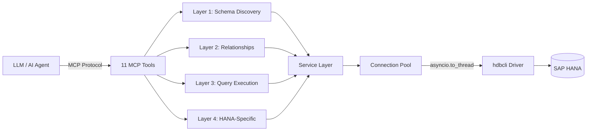
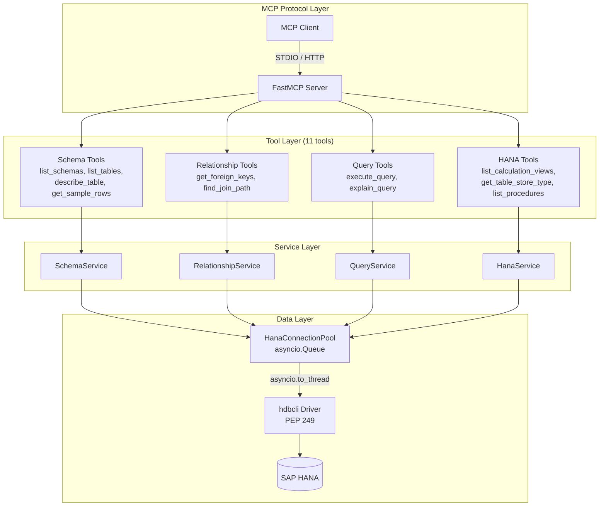

# SAP HANA MCP Server

The SAP HANA MCP Server (`mamba-mcp-hana`) provides read-only database access to SAP HANA instances through the Model Context Protocol. It exposes 11 MCP tools across 4 layers — schema discovery, relationship exploration, query execution, and HANA-specific introspection — enabling LLMs to explore and query SAP HANA databases safely.

## Overview



**Key capabilities:**

- **11 MCP tools** organized in 4 layers for progressive database exploration
- **SAP HANA Cloud and on-premise** support with automatic TLS detection
- **hdbcli driver** with async wrapper (`asyncio.to_thread`) for non-blocking operation
- **Queue-based connection pool** with health checks (`SELECT 1 FROM DUMMY`)
- **Read-only SQL enforcement** with keyword blocking, comment/string stripping, and parameterized queries
- **HANA-specific tools** for calculation views, column/row store type inspection, and stored procedures

## Installation

```bash
pip install mamba-mcp-hana
```

!!! info "Dependencies"
    The following packages are installed automatically:

    - `hdbcli` — SAP HANA database client driver
    - `mamba-mcp-core` — Shared utilities (CLI helpers, error models, fuzzy matching)
    - `mcp>=1.0.0` — Model Context Protocol SDK (FastMCP)
    - `pydantic-settings>=2.0.0` — Configuration management
    - `typer>=0.12.0` — CLI framework

## Quick Start

### 1. Create a configuration file

=== "HANA Cloud"

    ```env title="mamba.env"
    MAMBA_MCP_HANA_DB_HOST=your-instance.hana.trial-us10.hanacloud.ondemand.com
    MAMBA_MCP_HANA_DB_PORT=443
    MAMBA_MCP_HANA_DB_USER=mcp_reader
    MAMBA_MCP_HANA_DB_PASSWORD=SecurePassword123
    ```

    !!! tip
        When port is `443`, TLS encryption is automatically enabled — no need to set `DB_ENCRYPT`.

=== "HANA On-Premise"

    ```env title="mamba.env"
    MAMBA_MCP_HANA_DB_HOST=hana-server.corp.local
    MAMBA_MCP_HANA_DB_PORT=30015
    MAMBA_MCP_HANA_DB_USER=mcp_reader
    MAMBA_MCP_HANA_DB_PASSWORD=SecurePassword123
    MAMBA_MCP_HANA_DB_ENCRYPT=true
    MAMBA_MCP_HANA_DB_SSL_VALIDATE=true
    ```

=== "hdbuserstore"

    ```env title="mamba.env"
    MAMBA_MCP_HANA_DB_HOST=hana-server.corp.local
    MAMBA_MCP_HANA_DB_PORT=30015
    MAMBA_MCP_HANA_DB_USERKEY=MCP_KEY
    ```

    !!! note
        The `hdbuserstore` key must be pre-configured on the host machine using the `hdbuserstore` CLI tool. This method avoids storing passwords in configuration files.

### 2. Test connectivity

```bash
mamba-mcp-hana --env-file mamba.env test
```

A successful connection prints `Connection successful` and exits with code 0.

### 3. Start the server

```bash
# STDIO transport (default — for direct MCP client integration)
mamba-mcp-hana --env-file mamba.env

# Streamable HTTP transport
MAMBA_MCP_HANA_TRANSPORT=http mamba-mcp-hana --env-file mamba.env
```

### 4. Connect with mamba-mcp-client

```bash
# Interactive TUI
uv run --package mamba-mcp-client mamba-mcp tui --stdio "mamba-mcp-hana --env-file mamba.env"

# List available tools
uv run --package mamba-mcp-client mamba-mcp tools --stdio "mamba-mcp-hana --env-file mamba.env"

# Call a tool directly
uv run --package mamba-mcp-client mamba-mcp call list_schemas \
  --args '{"include_system": false}' \
  --stdio "mamba-mcp-hana --env-file mamba.env"
```

## Configuration

All configuration uses the `MAMBA_MCP_HANA_` prefix. Settings can be provided via environment variables or a `mamba.env` file (auto-discovered from the current directory or `~/mamba.env`).

### Database Settings

| Variable | Type | Default | Description |
|---|---|---|---|
| `MAMBA_MCP_HANA_DB_HOST` | `str` | `localhost` | HANA server hostname |
| `MAMBA_MCP_HANA_DB_PORT` | `int` | `30015` | HANA server port |
| `MAMBA_MCP_HANA_DB_NAME` | `str` | `None` | Tenant database name (optional, for tenant routing) |
| `MAMBA_MCP_HANA_DB_USER` | `str` | `None` | Database username (required*) |
| `MAMBA_MCP_HANA_DB_PASSWORD` | `SecretStr` | `None` | Database password (required*) |
| `MAMBA_MCP_HANA_DB_ENCRYPT` | `bool` | auto | Enable TLS encryption (auto-enabled for port 443) |
| `MAMBA_MCP_HANA_DB_SSL_VALIDATE` | `bool` | `true` | Validate SSL certificate |
| `MAMBA_MCP_HANA_DB_USERKEY` | `str` | `None` | hdbuserstore key (alternative auth*) |

!!! warning "Authentication"
    You must provide **either** `DB_USER` + `DB_PASSWORD` **or** `DB_USERKEY`. If both are provided, user/password takes precedence. Startup fails if neither is configured.

### Connection Pool Settings

| Variable | Type | Default | Description |
|---|---|---|---|
| `MAMBA_MCP_HANA_POOL_SIZE` | `int` | `5` | Maximum connections in the pool (1–20) |
| `MAMBA_MCP_HANA_POOL_TIMEOUT` | `float` | `30.0` | Timeout in seconds when waiting to acquire a connection |
| `MAMBA_MCP_HANA_STATEMENT_TIMEOUT` | `int` | `30000` | Default query timeout in milliseconds (min: 1000) |
| `MAMBA_MCP_HANA_DEFAULT_SCHEMA` | `str` | `None` | Default schema for tool queries |

### Server Settings

| Variable | Type | Default | Description |
|---|---|---|---|
| `MAMBA_MCP_HANA_TRANSPORT` | `str` | `stdio` | Transport type: `stdio`, `http`, or `streamable-http` |
| `MAMBA_MCP_HANA_SERVER_HOST` | `str` | `0.0.0.0` | HTTP server bind address |
| `MAMBA_MCP_HANA_SERVER_PORT` | `int` | `8080` | HTTP server bind port |
| `MAMBA_MCP_HANA_LOG_LEVEL` | `str` | `INFO` | Logging level (`DEBUG`, `INFO`, `WARNING`, `ERROR`) |
| `MAMBA_MCP_HANA_LOG_FORMAT` | `str` | `json` | Log output format: `json` or `text` |

!!! note "Transport Normalization"
    Both `http` and `streamable-http` are accepted as transport values. The value `http` is automatically normalized to `streamable-http` by the core transport utility.

## Tool Reference

### Layer 1: Schema Discovery

These read-only tools are the starting point for exploring an unfamiliar HANA database.

#### `list_schemas`

List all database schemas in the SAP HANA instance.

| Parameter | Type | Default | Description |
|---|---|---|---|
| `include_system` | `bool` | `false` | Include system schemas (`_SYS_*`, `SYS`, `SYSTEM`) |

??? example "Example Response"

    ```json
    {
      "schemas": [
        {
          "name": "SALES",
          "owner": "SYSTEM",
          "table_count": 12,
          "is_system": false
        },
        {
          "name": "HR",
          "owner": "SYSTEM",
          "table_count": 8,
          "is_system": false
        }
      ],
      "count": 2
    }
    ```

---

#### `list_tables`

List all tables and views in a specific schema. Returns metadata including record counts, column counts, and **store type** (COLUMN or ROW) — a HANA-specific field not found in PostgreSQL.

| Parameter | Type | Default | Description |
|---|---|---|---|
| `schema_name` | `str` | *required* | Schema to list tables from |
| `include_views` | `bool` | `true` | Include views in the listing |
| `name_pattern` | `str \| None` | `None` | SQL LIKE pattern to filter table names (e.g., `'USER%'`) |

??? example "Example Response"

    ```json
    {
      "tables": [
        {
          "name": "ORDERS",
          "type": "TABLE",
          "record_count": 150000,
          "column_count": 12,
          "store_type": "COLUMN",
          "is_column_table": true
        },
        {
          "name": "CONFIG",
          "type": "TABLE",
          "record_count": 45,
          "column_count": 3,
          "store_type": "ROW",
          "is_column_table": false
        }
      ],
      "schema_name": "SALES",
      "count": 2
    }
    ```

---

#### `describe_table`

Get the detailed structure of a table or view, including columns, indexes, and constraints.

| Parameter | Type | Default | Description |
|---|---|---|---|
| `table_name` | `str` | *required* | Name of the table or view |
| `schema_name` | `str` | *required* | Schema containing the table |
| `include_indexes` | `bool` | `true` | Include index information |
| `include_constraints` | `bool` | `true` | Include constraint information |

??? example "Example Response"

    ```json
    {
      "table_name": "ORDERS",
      "schema_name": "SALES",
      "columns": [
        {
          "name": "ORDER_ID",
          "data_type": "BIGINT",
          "length": null,
          "scale": null,
          "nullable": false,
          "default_value": null,
          "position": 1,
          "comment": "Unique order identifier"
        },
        {
          "name": "CUSTOMER_ID",
          "data_type": "INTEGER",
          "length": null,
          "scale": null,
          "nullable": false,
          "default_value": null,
          "position": 2,
          "comment": null
        }
      ],
      "indexes": [
        {
          "name": "IDX_ORDERS_CUSTOMER",
          "columns": ["CUSTOMER_ID"],
          "is_unique": false,
          "index_type": "CPBTREE"
        }
      ],
      "constraints": [
        {
          "name": "PK_ORDERS",
          "constraint_type": "PRIMARY KEY",
          "columns": ["ORDER_ID"]
        }
      ],
      "is_view": false
    }
    ```

---

#### `get_sample_rows`

Retrieve sample rows from a table to understand data patterns and formats.

| Parameter | Type | Default | Description |
|---|---|---|---|
| `table_name` | `str` | *required* | Name of the table to sample |
| `schema_name` | `str` | *required* | Schema containing the table |
| `limit` | `int` | `10` | Number of rows to retrieve (1–100) |
| `columns` | `list[str] \| None` | `None` | Specific columns to include (all if `None`) |
| `where_clause` | `str \| None` | `None` | WHERE filter without the `WHERE` keyword |
| `randomize` | `bool` | `false` | Randomize row selection via `ORDER BY RAND()` |

??? example "Example Response"

    ```json
    {
      "table_name": "ORDERS",
      "schema_name": "SALES",
      "columns": ["ORDER_ID", "CUSTOMER_ID", "ORDER_DATE", "TOTAL"],
      "rows": [
        {"ORDER_ID": 1001, "CUSTOMER_ID": 42, "ORDER_DATE": "2024-01-15", "TOTAL": 299.99},
        {"ORDER_ID": 1002, "CUSTOMER_ID": 17, "ORDER_DATE": "2024-01-16", "TOTAL": 149.50}
      ],
      "row_count": 2,
      "total_count": 150000
    }
    ```

### Layer 2: Relationships

Tools for discovering foreign key relationships and join paths between tables.

!!! warning "Row Store Limitation"
    SAP HANA **row store** tables do not support foreign key constraints. Relationship tools may return empty results for row store tables. Use `get_table_store_type` to check a table's store type.

#### `get_foreign_keys`

Get outgoing and incoming foreign key relationships for a table.

| Parameter | Type | Default | Description |
|---|---|---|---|
| `table_name` | `str` | *required* | Table to inspect |
| `schema_name` | `str` | *required* | Schema containing the table |

??? example "Example Response"

    ```json
    {
      "table_name": "ORDER_ITEMS",
      "schema_name": "SALES",
      "outgoing": [
        {
          "constraint_name": "FK_ITEMS_ORDER",
          "source_schema": "SALES",
          "source_table": "ORDER_ITEMS",
          "source_columns": ["ORDER_ID"],
          "target_schema": "SALES",
          "target_table": "ORDERS",
          "target_columns": ["ORDER_ID"],
          "delete_rule": "CASCADE"
        }
      ],
      "incoming": [],
      "outgoing_count": 1,
      "incoming_count": 0
    }
    ```

---

#### `find_join_path`

Find join paths between two tables using breadth-first search over foreign key relationships. Returns all discovered paths sorted by length (shortest first) with generated SQL JOIN examples.

| Parameter | Type | Default | Description |
|---|---|---|---|
| `from_table` | `str` | *required* | Starting table name |
| `to_table` | `str` | *required* | Target table name |
| `from_schema` | `str` | *required* | Schema of the starting table |
| `to_schema` | `str \| None` | `from_schema` | Schema of the target table |
| `max_depth` | `int` | `4` | Maximum number of joins to traverse (1–6) |

??? example "Example Response"

    ```json
    {
      "from_table": "ORDER_ITEMS",
      "to_table": "CUSTOMERS",
      "paths": [
        {
          "steps": [
            {
              "from_schema": "SALES",
              "from_table": "ORDER_ITEMS",
              "from_column": "ORDER_ID",
              "to_schema": "SALES",
              "to_table": "ORDERS",
              "to_column": "ORDER_ID",
              "constraint_name": "FK_ITEMS_ORDER",
              "direction": "outgoing"
            },
            {
              "from_schema": "SALES",
              "from_table": "ORDERS",
              "from_column": "CUSTOMER_ID",
              "to_schema": "SALES",
              "to_table": "CUSTOMERS",
              "to_column": "CUSTOMER_ID",
              "constraint_name": "FK_ORDERS_CUSTOMER",
              "direction": "outgoing"
            }
          ],
          "length": 2,
          "sql_example": "SELECT * FROM \"SALES\".\"ORDER_ITEMS\" JOIN \"SALES\".\"ORDERS\" ON ..."
        }
      ],
      "path_count": 1
    }
    ```

### Layer 3: Query Execution

Read-only query tools with strict safety validation. All write operations are blocked at the tool layer before reaching the database.

#### `execute_query`

Execute a read-only SQL query with optional parameterized values.

| Parameter | Type | Default | Description |
|---|---|---|---|
| `sql` | `str` | *required* | SQL SELECT query (max 100,000 characters) |
| `params` | `dict \| list \| None` | `None` | Bind parameters (`list` for `?`, `dict` for `:name`) |
| `limit` | `int` | `1000` | Maximum rows to return (1–10,000) |
| `timeout_ms` | `int \| None` | `None` | Query timeout in ms (uses server default if unset) |

!!! note "HANA Parameter Syntax"
    SAP HANA uses `?` for positional parameters and `:name` for named parameters — different from PostgreSQL's `$1, $2` syntax.

    **Positional:** `SELECT * FROM "SALES"."ORDERS" WHERE TOTAL > ? AND STATUS = ?`
    with `params: [100.00, "SHIPPED"]`

    **Named:** `SELECT * FROM "SALES"."ORDERS" WHERE TOTAL > :min_total AND STATUS = :status`
    with `params: {"min_total": 100.00, "status": "SHIPPED"}`

??? example "Example Response"

    ```json
    {
      "result": {
        "columns": ["ORDER_ID", "CUSTOMER_ID", "TOTAL"],
        "rows": [
          {"ORDER_ID": 1001, "CUSTOMER_ID": 42, "TOTAL": 299.99},
          {"ORDER_ID": 1005, "CUSTOMER_ID": 42, "TOTAL": 549.00}
        ],
        "row_count": 2,
        "execution_time_ms": 12.45,
        "truncated": false,
        "warning": null
      },
      "query_hash": "a1b2c3d4"
    }
    ```

---

#### `explain_query`

Get the execution plan for a SQL query without executing it. Uses HANA's `EXPLAIN PLAN SET STATEMENT_NAME` mechanism, which transparently handles the write-read-cleanup cycle of `EXPLAIN_PLAN_TABLE`.

| Parameter | Type | Default | Description |
|---|---|---|---|
| `sql` | `str` | *required* | SQL query to explain (SELECT/WITH only) |
| `params` | `dict \| list \| None` | `None` | Bind parameters for accurate cost estimates |
| `format` | `str` | `text` | Output format: `text` or `json` |

??? example "Example Response"

    ```json
    {
      "nodes": [
        {
          "operator": "PROJECT",
          "table_name": null,
          "schema_name": null,
          "cost": 150.0,
          "cardinality": 1000.0,
          "details": {
            "execution_engine": "HEX",
            "operator_id": 1,
            "parent_operator_id": null
          }
        },
        {
          "operator": "COLUMN TABLE SCAN",
          "table_name": "ORDERS",
          "schema_name": "SALES",
          "cost": 100.0,
          "cardinality": 1000.0,
          "details": {
            "execution_engine": "HEX",
            "operator_id": 2,
            "parent_operator_id": 1
          }
        }
      ],
      "total_cost": 150.0,
      "plan_type": "HANA EXPLAIN PLAN",
      "original_query": "SELECT * FROM \"SALES\".\"ORDERS\" WHERE TOTAL > 100"
    }
    ```

### Layer 4: HANA-Specific

Tools unique to SAP HANA that have no equivalent in other database servers. These provide insight into HANA-specific objects and storage characteristics.

#### `list_calculation_views`

List calculation views (CALC, JOIN, OLAP types) in a schema with their validity status and column counts.

| Parameter | Type | Default | Description |
|---|---|---|---|
| `schema_name` | `str` | *required* | Schema to list calculation views from |
| `include_columns` | `bool` | `false` | Include column metadata for each view |

!!! info "Analytic Privileges"
    Calculation views are listed based on metadata visibility. Querying data through these views may require additional analytic privileges granted by a HANA administrator.

??? example "Example Response"

    ```json
    {
      "views": [
        {
          "name": "CV_SALES_SUMMARY",
          "schema_name": "SALES",
          "type": "OLAP",
          "description": "Aggregated sales by region",
          "is_active": true,
          "column_count": 8,
          "columns": []
        }
      ],
      "schema_name": "SALES",
      "count": 1
    }
    ```

---

#### `get_table_store_type`

Get the storage type (COLUMN or ROW) for a table, along with partitioning, compression status, and optimization implications.

| Parameter | Type | Default | Description |
|---|---|---|---|
| `table_name` | `str` | *required* | Table to check |
| `schema_name` | `str` | *required* | Schema containing the table |

??? example "Example Response"

    ```json
    {
      "store_info": {
        "table_name": "ORDERS",
        "schema_name": "SALES",
        "store_type": "COLUMN",
        "is_column_table": true,
        "has_partitions": true,
        "partition_count": 4,
        "is_compressed": true,
        "implications": "Column store: Optimized for analytical queries, aggregations, and large scans. Supports foreign key constraints. Data is compressed by default.",
        "note": null
      }
    }
    ```

---

#### `list_procedures`

List stored procedures in a schema with their language type, read-only status, and parameter counts.

| Parameter | Type | Default | Description |
|---|---|---|---|
| `schema_name` | `str` | *required* | Schema to list procedures from |
| `include_parameters` | `bool` | `false` | Include parameter details (name, type, direction) |

??? example "Example Response"

    ```json
    {
      "procedures": [
        {
          "name": "CALC_MONTHLY_TOTALS",
          "schema_name": "SALES",
          "type": "SQLSCRIPT",
          "parameter_count": 2,
          "is_read_only": true,
          "parameters": [
            {
              "name": "IN_YEAR",
              "data_type": "INTEGER",
              "direction": "IN",
              "position": 1,
              "default_value": null
            },
            {
              "name": "OUT_RESULT",
              "data_type": "TABLE",
              "direction": "OUT",
              "position": 2,
              "default_value": null
            }
          ]
        }
      ],
      "schema_name": "SALES",
      "count": 1
    }
    ```

## Security

### Read-Only Enforcement

All queries pass through a multi-layer validation pipeline before reaching the database:

1. **Comment and string stripping** — SQL comments (`--`, `/* */`) and string literals (`'...'`) are removed before keyword scanning, preventing bypass via embedded keywords.
2. **Blocked keyword detection** — A regex scan checks for write operation keywords with word-boundary matching:

    ```python title="Blocked keywords"
    INSERT, UPDATE, DELETE, UPSERT, MERGE,       # Data modification
    CREATE, ALTER, DROP, TRUNCATE, RENAME,        # Schema modification
    GRANT, REVOKE,                                # Permissions
    SET, RESET,                                   # Session
    CALL, IMPORT, EXPORT, LOAD, UNLOAD            # Administrative
    ```

3. **SELECT/WITH enforcement** — After stripping, the query must start with `SELECT` or `WITH`.
4. **Parameterized queries** — Bind parameters (`?` and `:name`) prevent SQL injection.
5. **Statement timeout** — Queries exceeding the configured timeout are terminated.
6. **Row limits** — Results are capped at the configured limit (default 1,000, max 10,000).

### Credential Protection

The `DB_PASSWORD` field uses Pydantic's `SecretStr` type, which prevents accidental exposure in logs, debug output, and serialization. The password value is only revealed when explicitly calling `.get_secret_value()` during connection creation.

### Recommended HANA User Setup

Create a restricted database user with minimal read-only privileges:

```sql
-- Create a restricted user (cannot log in interactively)
CREATE RESTRICTED USER mcp_reader PASSWORD "SecurePassword123";

-- Grant catalog access for schema/table discovery
GRANT CATALOG READ TO mcp_reader;

-- Grant read access to specific schemas
GRANT SELECT ON SCHEMA "SALES" TO mcp_reader;
GRANT SELECT ON SCHEMA "HR" TO mcp_reader;

-- For explain_query tool (EXPLAIN_PLAN_TABLE access)
-- The table is auto-created in the user's default schema on first use.
-- No additional grants needed if the user has a writable default schema.
```

!!! danger "Principle of Least Privilege"
    Never grant the MCP user `DATA ADMIN`, `DEVELOPMENT`, or other broad system privileges. Restrict access to only the schemas the LLM needs to explore.

## HANA Cloud vs On-Premise

| Feature | HANA Cloud | HANA On-Premise |
|---|---|---|
| Default port | `443` | `3<instance>15` (e.g., `30015` for instance 00) |
| TLS encryption | Always on (auto-detected) | Optional, must be configured |
| Connection | Public endpoint via hostname | Direct network or VPN |
| hdbuserstore | Not available | Supported |
| Tenant routing | Single-tenant (no `DB_NAME` needed) | Multi-tenant may require `DB_NAME` |

### Port Convention (On-Premise)

On-premise HANA instances use the port format `3<instance_number>15`:

| Instance Number | Port |
|---|---|
| 00 | 30015 |
| 01 | 30115 |
| 02 | 30215 |
| 90 | 39015 |

### Configuration Examples

=== "HANA Cloud (Trial)"

    ```env title="mamba.env"
    MAMBA_MCP_HANA_DB_HOST=abc12345-defg-6789-hijk-lmnopqrstuv.hana.trial-us10.hanacloud.ondemand.com
    MAMBA_MCP_HANA_DB_PORT=443
    MAMBA_MCP_HANA_DB_USER=mcp_reader
    MAMBA_MCP_HANA_DB_PASSWORD=SecurePassword123
    MAMBA_MCP_HANA_DEFAULT_SCHEMA=SALES
    ```

=== "HANA Cloud (Production)"

    ```env title="mamba.env"
    MAMBA_MCP_HANA_DB_HOST=prod-instance.hana.prod-eu10.hanacloud.ondemand.com
    MAMBA_MCP_HANA_DB_PORT=443
    MAMBA_MCP_HANA_DB_USER=mcp_reader
    MAMBA_MCP_HANA_DB_PASSWORD=SecurePassword123
    MAMBA_MCP_HANA_POOL_SIZE=10
    MAMBA_MCP_HANA_STATEMENT_TIMEOUT=60000
    MAMBA_MCP_HANA_LOG_LEVEL=WARNING
    ```

=== "On-Premise (Instance 00)"

    ```env title="mamba.env"
    MAMBA_MCP_HANA_DB_HOST=hana-server.corp.local
    MAMBA_MCP_HANA_DB_PORT=30015
    MAMBA_MCP_HANA_DB_USER=mcp_reader
    MAMBA_MCP_HANA_DB_PASSWORD=SecurePassword123
    MAMBA_MCP_HANA_DB_ENCRYPT=true
    MAMBA_MCP_HANA_DB_SSL_VALIDATE=true
    MAMBA_MCP_HANA_DEFAULT_SCHEMA=PRODUCTION
    ```

=== "On-Premise (hdbuserstore)"

    ```env title="mamba.env"
    MAMBA_MCP_HANA_DB_HOST=hana-server.corp.local
    MAMBA_MCP_HANA_DB_PORT=30015
    MAMBA_MCP_HANA_DB_USERKEY=MCP_KEY
    ```

    Set up the key beforehand:

    ```bash
    hdbuserstore SET MCP_KEY hana-server.corp.local:30015 mcp_reader SecurePassword123
    ```

## Architecture

### Internal Architecture



### Key Design Decisions

**hdbcli + asyncio.to_thread (no SQLAlchemy)**

:   The `hdbcli` driver is SAP's official synchronous PEP 249 driver. It is wrapped with `asyncio.to_thread()` for non-blocking operation. SQLAlchemy was intentionally omitted — the server only performs read-only queries against system views (`SYS.SCHEMAS`, `SYS.TABLES`, `SYS.TABLE_COLUMNS`, etc.), making a full ORM unnecessary overhead.

**Queue-based connection pool**

:   `HanaConnectionPool` uses `asyncio.Queue` for async-safe connection management. Connections are lazily created up to `pool_size`, health-checked with `SELECT 1 FROM DUMMY` before reuse, and automatically replaced if stale. When all connections are in use, `acquire()` waits up to `pool_timeout` seconds before raising `TimeoutError`.

**Service-per-layer pattern**

:   Each tool layer has a dedicated service class (`SchemaService`, `RelationshipService`, `QueryService`, `HanaService`) that encapsulates the SQL queries and result mapping. Tools themselves remain thin — they extract the pool from the lifespan context, call the service, and return the output model.

**AppContext via lifespan**

:   The `AppContext` dataclass (containing the connection pool and settings) is created during server startup via the `app_lifespan()` async context manager and made available to all tools through `ctx.request_context.lifespan_context`. The pool is tested on startup and gracefully closed on shutdown.

### Error Handling

Every tool returns either a typed Pydantic output model on success or a structured `ToolError` dict on failure. Error responses include:

- **Error code** — Machine-readable code (e.g., `SCHEMA_NOT_FOUND`, `INVALID_SQL`, `WRITE_OPERATION_DENIED`)
- **Message** — Human-readable description of what went wrong
- **Suggestion** — Actionable next step (e.g., "List available schemas with list_schemas")
- **Fuzzy matching** — When a schema or table name is not found, Levenshtein distance is used to suggest similar names from the database

```json title="Example error response"
{
  "error": true,
  "code": "TABLE_NOT_FOUND",
  "message": "Table 'ORDRS' not found in schema 'SALES'",
  "tool_name": "describe_table",
  "suggestion": "List tables in schema with list_tables",
  "context": {
    "similar_names": ["ORDERS", "ORDER_ITEMS"]
  }
}
```

## CLI Reference

```bash
# Start the MCP server (default: STDIO transport)
mamba-mcp-hana

# Start with a specific env file
mamba-mcp-hana --env-file /path/to/mamba.env

# Test database connectivity
mamba-mcp-hana test

# Test with a specific env file
mamba-mcp-hana --env-file mamba.env test
```

The env file is resolved in this order:

1. Explicit `--env-file` path (must exist)
2. `./mamba.env` in the current directory
3. `~/mamba.env` in the home directory
4. No env file (relies entirely on environment variables)
