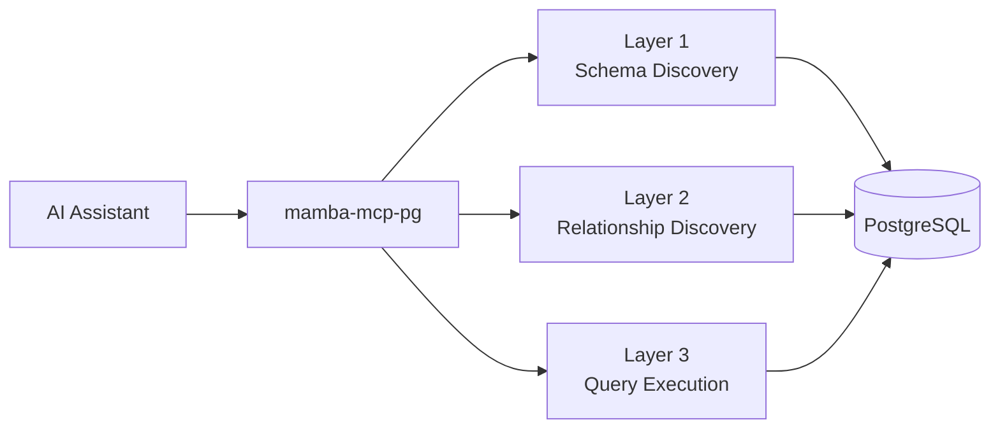
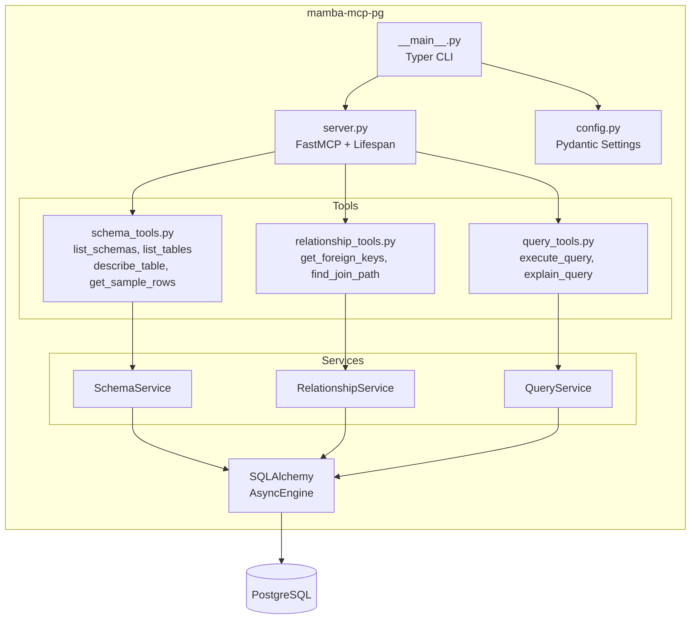
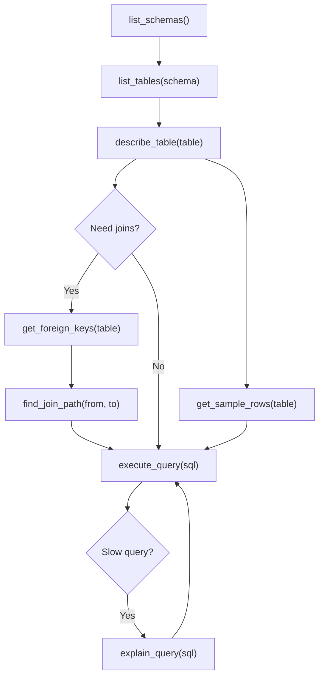

# PostgreSQL MCP Server

`mamba-mcp-pg` provides 8 MCP tools across 3 layers, designed for AI assistants to progressively explore PostgreSQL databases. Agents start with broad schema discovery, drill into relationships, and then execute targeted read-only queries — all with structured errors, fuzzy matching, and parameterized inputs.



## Features

- **8 MCP tools** across 3 layers for progressive database exploration
- **Read-only enforcement** — only `SELECT`/`WITH` queries allowed, 23 keyword categories blocked
- **Parameterized queries** — use `$1`, `$2` placeholders to prevent SQL injection
- **Fuzzy matching** — "did you mean?" suggestions for misspelled schema, table, and column names
- **BFS join pathfinding** — automatically discovers join paths between tables via foreign keys
- **Query plans** — `EXPLAIN` support with optional `ANALYZE` for real execution timing
- **Connection pooling** — SQLAlchemy async engine with configurable pool size and timeouts
- **Structured errors** — typed error codes with actionable suggestions

## Installation

Requires Python 3.11+.

```bash
pip install mamba-mcp-pg
```

Or, if developing within the monorepo:

```bash
uv sync --group dev
```

## Quick Start

### 1. Create a configuration file

``` title="mamba.env"
MAMBA_MCP_PG_DB_HOST=localhost
MAMBA_MCP_PG_DB_PORT=5432
MAMBA_MCP_PG_DB_NAME=mydb
MAMBA_MCP_PG_DB_USER=myuser
MAMBA_MCP_PG_DB_PASSWORD=mypassword
```

### 2. Test your connection

```bash
mamba-mcp-pg --env-file mamba.env test
```

### 3. Start the server

=== "stdio (default)"

    ```bash
    mamba-mcp-pg --env-file mamba.env
    ```

=== "Streamable HTTP"

    ```bash
    MAMBA_MCP_PG_TRANSPORT=streamable-http mamba-mcp-pg --env-file mamba.env
    ```

!!! tip "Auto-discovery"
    If you omit `--env-file`, the server checks for `./mamba.env` in the current directory, then falls back to `~/mamba.env`.

## Configuration

All settings use the `MAMBA_MCP_PG_` prefix and can be set via environment variables or a `mamba.env` file.

### Database Settings

| Variable | Description | Default |
|----------|-------------|---------|
| `MAMBA_MCP_PG_DB_HOST` | PostgreSQL host | `localhost` |
| `MAMBA_MCP_PG_DB_PORT` | PostgreSQL port | `5432` |
| `MAMBA_MCP_PG_DB_NAME` | Database name | *required* |
| `MAMBA_MCP_PG_DB_USER` | Database user | *required* |
| `MAMBA_MCP_PG_DB_PASSWORD` | Database password | *required* |
| `MAMBA_MCP_PG_POOL_SIZE` | Connection pool size (1-20) | `5` |
| `MAMBA_MCP_PG_POOL_TIMEOUT` | Pool checkout timeout in seconds | `30.0` |
| `MAMBA_MCP_PG_STATEMENT_TIMEOUT` | Query timeout in milliseconds (min 1000) | `30000` |
| `MAMBA_MCP_PG_DEFAULT_SCHEMA` | Default schema for tool operations | `public` |

### Server Settings

| Variable | Description | Default |
|----------|-------------|---------|
| `MAMBA_MCP_PG_TRANSPORT` | Transport type (`stdio`, `http`, `streamable-http`) | `stdio` |
| `MAMBA_MCP_PG_SERVER_HOST` | HTTP server bind address | `0.0.0.0` |
| `MAMBA_MCP_PG_SERVER_PORT` | HTTP server port (1-65535) | `8080` |
| `MAMBA_MCP_PG_LOG_LEVEL` | Log level (`DEBUG`, `INFO`, `WARNING`, `ERROR`) | `INFO` |
| `MAMBA_MCP_PG_LOG_FORMAT` | Log output format (`json`, `text`) | `json` |

!!! note "Transport normalization"
    Both `http` and `streamable-http` are accepted and normalized internally. The server uses `streamable-http` for all HTTP-based transports.

## Tool Reference

All 8 tools are organized into 3 progressive layers. Every tool is annotated as read-only and non-destructive.

---

### Layer 1: Schema Discovery

These tools help AI agents discover and understand the database schema structure. Use them as the first step when exploring an unfamiliar database.

#### `list_schemas`

List all database schemas with metadata including table counts.

| Parameter | Type | Default | Description |
|-----------|------|---------|-------------|
| `include_system` | `bool` | `false` | Include system schemas (`pg_*`, `information_schema`) |

??? example "Example Output"

    ```json
    {
      "schemas": [
        {
          "name": "public",
          "owner": "postgres",
          "description": null,
          "table_count": 15
        },
        {
          "name": "analytics",
          "owner": "app_user",
          "description": "Analytics and reporting tables",
          "table_count": 8
        }
      ],
      "total_count": 2
    }
    ```

---

#### `list_tables`

List tables and views in a schema with size, row count, and column information.

| Parameter | Type | Default | Description |
|-----------|------|---------|-------------|
| `schema_name` | `string` | `"public"` | Schema to list tables from |
| `include_views` | `bool` | `true` | Include views in the listing |
| `name_pattern` | `string \| null` | `null` | SQL `LIKE` pattern to filter names (e.g., `"user%"`) |

??? example "Example Output"

    ```json
    {
      "tables": [
        {
          "name": "users",
          "schema_name": "public",
          "type": "table",
          "description": "Application user accounts",
          "estimated_row_count": 12450,
          "size_bytes": 2097152,
          "size_pretty": "2 MB",
          "has_primary_key": true,
          "column_count": 9
        },
        {
          "name": "active_users",
          "schema_name": "public",
          "type": "view",
          "description": null,
          "estimated_row_count": 8200,
          "size_bytes": null,
          "size_pretty": null,
          "has_primary_key": false,
          "column_count": 5
        }
      ],
      "schema_name": "public",
      "total_count": 2
    }
    ```

---

#### `describe_table`

Get detailed column, index, and constraint information for a table.

| Parameter | Type | Default | Description |
|-----------|------|---------|-------------|
| `table_name` | `string` | *required* | Table to describe |
| `schema_name` | `string` | `"public"` | Schema containing the table |
| `include_indexes` | `bool` | `true` | Include index information |
| `include_constraints` | `bool` | `true` | Include constraint information |

??? example "Example Output"

    ```json
    {
      "table_name": "users",
      "schema_name": "public",
      "type": "table",
      "description": "Application user accounts",
      "columns": [
        {
          "name": "id",
          "data_type": "int4",
          "is_nullable": false,
          "default_value": "nextval('users_id_seq'::regclass)",
          "description": "Primary key",
          "is_primary_key": true,
          "is_unique": false,
          "foreign_key": null,
          "character_maximum_length": null,
          "numeric_precision": 32,
          "numeric_scale": 0
        },
        {
          "name": "email",
          "data_type": "varchar",
          "is_nullable": false,
          "default_value": null,
          "description": null,
          "is_primary_key": false,
          "is_unique": false,
          "foreign_key": null,
          "character_maximum_length": 255,
          "numeric_precision": null,
          "numeric_scale": null
        }
      ],
      "indexes": [
        {
          "name": "users_pkey",
          "columns": ["id"],
          "is_unique": true,
          "is_primary": true,
          "index_type": "btree",
          "description": null
        },
        {
          "name": "users_email_key",
          "columns": ["email"],
          "is_unique": true,
          "is_primary": false,
          "index_type": "btree",
          "description": null
        }
      ],
      "constraints": [
        {
          "name": "users_pkey",
          "type": "PRIMARY KEY",
          "columns": ["id"],
          "definition": null,
          "referenced_table": null
        }
      ],
      "estimated_row_count": 12450,
      "size_pretty": "2 MB"
    }
    ```

---

#### `get_sample_rows`

Preview data from a table with optional filtering and column selection.

| Parameter | Type | Default | Description |
|-----------|------|---------|-------------|
| `table_name` | `string` | *required* | Table to sample |
| `schema_name` | `string` | `"public"` | Schema containing the table |
| `limit` | `int` | `5` | Number of rows to return (1--100) |
| `columns` | `list[string] \| null` | `null` | Specific columns to include (all if null) |
| `where_clause` | `string \| null` | `null` | `WHERE` clause without the `WHERE` keyword |
| `randomize` | `bool` | `false` | Randomize row selection (slower on large tables) |

??? example "Example Output"

    ```json
    {
      "table_name": "users",
      "schema_name": "public",
      "columns": ["id", "email", "status", "created_at"],
      "rows": [
        {"id": 1, "email": "alice@example.com", "status": "active", "created_at": "2024-01-15T10:30:00"},
        {"id": 2, "email": "bob@example.com", "status": "active", "created_at": "2024-01-16T14:20:00"},
        {"id": 3, "email": "charlie@example.com", "status": "inactive", "created_at": "2024-02-01T09:00:00"}
      ],
      "row_count": 3,
      "total_table_rows": 12450,
      "note": "Showing first rows ordered by primary key"
    }
    ```

---

### Layer 2: Relationship Discovery

These tools help AI agents understand how tables relate to one another through foreign keys, enabling them to build correct JOIN queries.

#### `get_foreign_keys`

Get incoming and outgoing foreign key relationships for a table.

| Parameter | Type | Default | Description |
|-----------|------|---------|-------------|
| `table_name` | `string` | *required* | Table to inspect |
| `schema_name` | `string` | `"public"` | Schema containing the table |

??? example "Example Output"

    ```json
    {
      "table_name": "orders",
      "schema_name": "public",
      "outgoing": [
        {
          "constraint_name": "orders_user_id_fkey",
          "from_schema": "public",
          "from_table": "orders",
          "from_columns": ["user_id"],
          "to_schema": "public",
          "to_table": "users",
          "to_columns": ["id"],
          "on_update": "NO ACTION",
          "on_delete": "CASCADE"
        }
      ],
      "incoming": [
        {
          "constraint_name": "order_items_order_id_fkey",
          "from_schema": "public",
          "from_table": "order_items",
          "from_columns": ["order_id"],
          "to_schema": "public",
          "to_table": "orders",
          "to_columns": ["id"],
          "on_update": "NO ACTION",
          "on_delete": "CASCADE"
        }
      ],
      "outgoing_count": 1,
      "incoming_count": 1
    }
    ```

---

#### `find_join_path`

Discover join paths between two tables using BFS traversal of foreign key relationships. Returns SQL JOIN clause examples for each path found.

| Parameter | Type | Default | Description |
|-----------|------|---------|-------------|
| `from_table` | `string` | *required* | Starting table |
| `to_table` | `string` | *required* | Target table |
| `from_schema` | `string` | `"public"` | Schema of starting table |
| `to_schema` | `string` | `"public"` | Schema of target table |
| `max_depth` | `int` | `4` | Maximum joins to traverse (1--6) |

??? example "Example Output"

    ```json
    {
      "from_table": "order_items",
      "to_table": "users",
      "paths": [
        {
          "steps": [
            {
              "from_table": "order_items",
              "from_schema": "public",
              "from_column": "order_id",
              "to_table": "orders",
              "to_schema": "public",
              "to_column": "id",
              "join_type": "INNER JOIN",
              "constraint_name": "order_items_order_id_fkey"
            },
            {
              "from_table": "orders",
              "from_schema": "public",
              "from_column": "user_id",
              "to_table": "users",
              "to_schema": "public",
              "to_column": "id",
              "join_type": "INNER JOIN",
              "constraint_name": "orders_user_id_fkey"
            }
          ],
          "depth": 2,
          "sql_example": "FROM public.order_items INNER JOIN public.orders ON order_items.order_id = orders.id INNER JOIN public.users ON orders.user_id = users.id"
        }
      ],
      "paths_found": 1,
      "note": null
    }
    ```

---

### Layer 3: Query Execution

These tools allow AI agents to execute read-only SQL queries and analyze query performance. All queries are validated against a strict security policy before execution.

#### `execute_query`

Execute a read-only SQL query with parameterized inputs.

| Parameter | Type | Default | Description |
|-----------|------|---------|-------------|
| `sql` | `string` | *required* | SQL `SELECT` query (use `$1`, `$2` for parameters) |
| `params` | `list \| null` | `null` | Parameter values matching `$1`, `$2`, etc. |
| `limit` | `int` | `1000` | Maximum rows to return (1--10,000) |
| `timeout_ms` | `int \| null` | `null` | Query timeout in ms (uses server default if not set) |

!!! warning "Security"
    Only `SELECT` and `WITH...SELECT` queries are allowed. Queries containing mutation keywords are rejected before reaching the database. See [Query Security](#query-security) for details.

??? example "Example Output"

    ```json
    {
      "columns": [
        {"name": "id", "data_type": "unknown"},
        {"name": "email", "data_type": "unknown"},
        {"name": "status", "data_type": "unknown"}
      ],
      "rows": [
        {"id": 1, "email": "alice@example.com", "status": "active"},
        {"id": 2, "email": "bob@example.com", "status": "active"}
      ],
      "row_count": 2,
      "has_more": false,
      "execution_time_ms": 12.34,
      "query_hash": "a1b2c3d4"
    }
    ```

??? example "Parameterized Query"

    ```json
    {
      "sql": "SELECT id, email FROM users WHERE status = $1 AND created_at > $2",
      "params": ["active", "2024-01-01"]
    }
    ```

    The `$1`, `$2` placeholders are converted internally to named parameters for safe execution via SQLAlchemy.

---

#### `explain_query`

Get the PostgreSQL execution plan for a query. Use this to understand and optimize query performance before running expensive queries.

| Parameter | Type | Default | Description |
|-----------|------|---------|-------------|
| `sql` | `string` | *required* | SQL query to explain |
| `params` | `list \| null` | `null` | Parameter values for accurate estimates |
| `analyze` | `bool` | `false` | Actually execute the query for real timings |
| `format` | `string` | `"text"` | Output format: `text`, `json`, or `yaml` |
| `verbose` | `bool` | `false` | Include additional detail in the plan |
| `buffers` | `bool` | `false` | Include buffer statistics (requires `analyze=true`) |

!!! info "ANALYZE mode"
    When `analyze=true`, the query is actually executed to gather real timing and row-count data. This is more accurate than estimates but takes longer. The `buffers` option only takes effect when `analyze` is also enabled.

??? example "Example Output (text format)"

    ```json
    {
      "plan": "Seq Scan on users  (cost=0.00..1.15 rows=15 width=128)\
  Filter: (status = 'active'::text)",
      "format": "text",
      "estimated_cost": null,
      "estimated_rows": null,
      "actual_time_ms": null,
      "warnings": null
    }
    ```

## Query Security

!!! danger "Read-Only Enforcement"
    The server enforces strict read-only access at the application layer. All SQL is validated **before** reaching the database engine.

### Validation Rules

1. **Statement type check** — queries must start with `SELECT` or `WITH` (case-insensitive)
2. **Blocked keyword scan** — regex-based word-boundary matching rejects queries containing any of 23 blocked keywords
3. **Parameterized inputs** — use `$1`, `$2` placeholders instead of string interpolation
4. **Statement timeout** — configurable server-wide default with per-query override

### Blocked Keywords

Organized by category, the following keywords are rejected anywhere in the query:

| Category | Keywords |
|----------|----------|
| **Data Modification** | `INSERT`, `UPDATE`, `DELETE`, `UPSERT`, `MERGE` |
| **Schema Modification** | `CREATE`, `ALTER`, `DROP`, `TRUNCATE`, `RENAME` |
| **Permissions** | `GRANT`, `REVOKE` |
| **Session** | `SET`, `RESET`, `DISCARD` |
| **Administrative** | `VACUUM`, `ANALYZE`, `CLUSTER`, `REINDEX`, `COPY` |
| **Transaction** | `BEGIN`, `COMMIT`, `ROLLBACK`, `SAVEPOINT` |

### Error Handling

When a query is rejected, the server returns a structured error with an actionable suggestion:

```json
{
  "error": {
    "code": "WRITE_OPERATION_DENIED",
    "message": "Query contains blocked keyword: DELETE",
    "suggestion": "This server only supports read operations (SELECT queries)."
  },
  "tool_name": "execute_query",
  "input_received": {
    "sql": "DELETE FROM users WHERE id = 1"
  }
}
```

All errors include a machine-readable `code`, a human-readable `message`, and an actionable `suggestion`. When a schema, table, or column name is misspelled, the fuzzy matching system provides "did you mean?" alternatives using Levenshtein distance.

## Error Codes

| Code | Meaning | Default Suggestion |
|------|---------|-------------------|
| `SCHEMA_NOT_FOUND` | Schema does not exist | List available schemas with `list_schemas` |
| `TABLE_NOT_FOUND` | Table does not exist in schema | List tables in schema with `list_tables` |
| `COLUMN_NOT_FOUND` | Column does not exist on table | Describe table to see available columns |
| `INVALID_SQL` | SQL syntax error | Review query syntax |
| `WRITE_OPERATION_DENIED` | Mutation keyword detected | This server only supports read operations |
| `QUERY_TIMEOUT` | Statement timeout exceeded | Simplify query or increase timeout |
| `CONNECTION_ERROR` | Database connectivity issue | Check database connectivity |
| `PERMISSION_DENIED` | Insufficient database privileges | Contact database administrator |
| `PARAMETER_ERROR` | Invalid parameter value | Review parameter constraints |
| `PATH_NOT_FOUND` | No FK path between tables | Tables may not be related via foreign keys |

## Architecture



The server follows a layered architecture:

- **CLI layer** (`__main__.py`) — Typer app that handles env file resolution, logging setup, and transport selection. Running without a subcommand starts the server; the `test` subcommand validates connectivity.
- **Server layer** (`server.py`) — Creates the `FastMCP` instance with an `app_lifespan` async context manager that initializes the SQLAlchemy engine, tests the connection, and yields an `AppContext` dataclass.
- **Tool layer** (`tools/`) — Each `@mcp.tool()` handler follows a consistent pattern: timing, context extraction, service delegation, Pydantic output construction, and structured error handling.
- **Service layer** (`database/`) — `SchemaService`, `RelationshipService`, and `QueryService` encapsulate SQL queries and business logic. `QueryService` includes the security validation layer.
- **Engine** — SQLAlchemy async engine with `asyncpg` driver, configurable connection pooling, and statement-level timeouts.

## Using with mamba-mcp-client

The `mamba-mcp-client` package provides a TUI and CLI for testing and debugging MCP servers, including `mamba-mcp-pg`.

=== "Interactive TUI"

    ```bash
    uv run --package mamba-mcp-client mamba-mcp tui \
      --stdio "mamba-mcp-pg --env-file mamba.env"
    ```

=== "List tools"

    ```bash
    uv run --package mamba-mcp-client mamba-mcp tools \
      --stdio "mamba-mcp-pg --env-file mamba.env"
    ```

=== "Call a tool"

    ```bash
    uv run --package mamba-mcp-client mamba-mcp call list_schemas \
      --args '{"include_system": false}' \
      --stdio "mamba-mcp-pg --env-file mamba.env"
    ```

=== "HTTP transport"

    ```bash
    # Start the server first
    MAMBA_MCP_PG_TRANSPORT=streamable-http mamba-mcp-pg --env-file mamba.env

    # In another terminal
    uv run --package mamba-mcp-client mamba-mcp tui \
      --http http://localhost:8080/mcp
    ```

## Typical Agent Workflow

An AI agent exploring an unfamiliar database would typically use the tools in this order:



1. **Discover schemas** with `list_schemas` to understand the database layout
2. **Browse tables** with `list_tables` to find relevant data
3. **Inspect structure** with `describe_table` to understand columns, types, and constraints
4. **Preview data** with `get_sample_rows` to understand actual values and patterns
5. **Map relationships** with `get_foreign_keys` and `find_join_path` to build correct JOINs
6. **Query data** with `execute_query` using parameterized inputs
7. **Optimize** with `explain_query` if performance is a concern
